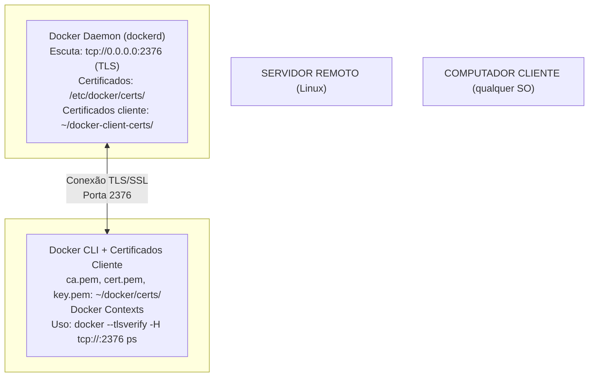

# Docker Remoto com TLS - Guia Completo

Este guia descreve como instalar e configurar o Docker com acesso remoto seguro usando TLS (Transport Layer Security). O processo é dividido em duas partes: instalação no servidor remoto e configuração no cliente.

## 📋 Índice

- [Arquitetura](#arquitetura)
- [Pré-requisitos](#pré-requisitos)
- [Parte 1: Servidor Remoto](#parte-1-servidor-remoto)
- [Parte 2: Computador Cliente](#parte-2-computador-cliente)
- [Uso Prático](#uso-prático)
- [Solução de Problemas](#solução-de-problemas)
- [Segurança](#segurança)

## 🏗️ Arquitetura



## 🔧 Pré-requisitos

### Servidor Remoto

- **OS**: Ubuntu 20.04 LTS ou superior
- **Acesso**: Usuário com privilégios `sudo`
- **Conectividade**: Porta 2376 aberta/acessível
- **Pacotes**: Instalados automaticamente pelo script
  - curl, ca-certificates, gnupg, lsb-release, openssl

### Computador Cliente

- **Docker CLI**: Instalado localmente
- **Conectividade**: Rede com acesso ao servidor na porta 2376
- **Certificados**: Copiados do servidor
- **SO**: Linux, macOS ou Windows (com WSL2)

---

# PARTE 1: SERVIDOR REMOTO

Execute esta parte **no servidor Linux** onde o Docker será instalado.

## 1️⃣ Download do Script

```bash
# Clonar ou fazer download do repositório
git clone https://github.com/devopsvanilla/.BatOps.git
cd .BatOps/docker

# Ou se já tiver o arquivo
cd /caminho/para/.BatOps/docker
```

## 2️⃣ Dar Permissão de Execução

```bash
chmod +x install-docker-remote.sh
```

## 3️⃣ Executar o Script

```bash
sudo ./install-docker-remote.sh
```

## O que o Script Faz (No Servidor)
## 🧰 O que é Instalado pelo Script

O script `install-docker-remote.sh` instala e configura automaticamente:

- **Docker Engine, CLI e plugins**: Para execução e gerenciamento de containers.
- **Certificados TLS**: Para acesso remoto seguro.
- **Dependências essenciais**: curl, ca-certificates, gnupg, lsb-release, openssl, firewall (UFW).
- **Node.js e npm (via nvm)**: Necessários para instalar ferramentas baseadas em Node.
- **Dockly**: Um dashboard interativo para gerenciar containers Docker diretamente pelo terminal.

### Sobre o Dockly

> **Dockly** é uma ferramenta de dashboard interativo para Docker, acessível via terminal. Permite visualizar, gerenciar e interagir com containers, imagens, volumes e redes de forma intuitiva, tudo em modo texto. Ideal para administradores que preferem uma interface rápida e sem depender de GUIs pesadas.

Instalação do Dockly é opcional e pode ser feita durante a execução do script. Após instalado, basta executar `dockly` no terminal para abrir o dashboard.

O script `install-docker-remote.sh` executa automaticamente:

1. ✅ **Verifica requisitos**
   - Confirma que é Ubuntu
   - Verifica/instala pacotes necessários
   - Valida permissões de sudo

2. 🔍 **Detecta informações do host**
   - Captura hostname do servidor
   - Identifica endereço IP da interface de rede

3 🐳 **Instala Docker** (se necessário)
   - Adiciona repositório oficial do Docker
   - Instala Docker Engine, CLI e plugins
   - Adiciona usuário ao grupo docker

4. 🔐 **Gera certificados TLS auto-assinados**
   - Cria Certificate Authority (CA) privada
   - Gera certificado do servidor (com IP e hostname)
   - Gera certificado do cliente para autenticação
   - Salva em `/etc/docker/certs` (servidor)
   - Salva em `~/docker-client-certs` (para copiar ao cliente)

5. ⚙️ **Configura Docker Daemon**
   - Habilita TLS com verificação obrigatória
   - Libera porta 2376/TCP
   - Mantém socket Unix para acesso local

6. 🔥 **Configura Firewall**
   - Libera porta 2376/TCP (se UFW está ativo)

7. 📦 **Prepara certificados para cliente**
   - Copia certificados para `~/docker-client-certs`
   - Ajusta permissões apropriadas

## 4️⃣ Verificar a Instalação (No Servidor)

```bash
# Verificar status do Docker
sudo systemctl status docker

# Testar Docker localmente
docker ps

# Verificar porta TLS
sudo netstat -tlnp | grep 2376
# ou
sudo ss -tlnp | grep dockerd
```

**Output esperado**:
```
tcp6       0      0 :::2376                 :::*                    LISTEN      1234/dockerd
```

## 5️⃣ Preparar Certificados para o Cliente

Os certificados do cliente estão em:
```
~/docker-client-certs/
├── ca.pem          (Certificado da CA)
├── cert.pem        (Certificado do cliente)
└── key.pem         (Chave privada do cliente)
```

**Próximo passo**: Copie estes 3 arquivos para o computador cliente.

---

# PARTE 2: COMPUTADOR CLIENTE

Execute esta parte **no seu computador** (Linux, macOS ou Windows com WSL2) que deseja usar Docker remoto.

## 1️⃣ Pré-requisito: Instalar Docker CLI

Se já tiver Docker instalado, pule este passo.

### No Linux (Ubuntu/Debian)

```bash
# Adicionar repositório
curl -fsSL https://download.docker.com/linux/ubuntu/gpg | sudo gpg --dearmor -o /usr/share/keyrings/docker-archive-keyring.gpg

echo "deb [arch=amd64 signed-by=/usr/share/keyrings/docker-archive-keyring.gpg] https://download.docker.com/linux/ubuntu $(lsb_release -cs) stable" | sudo tee /etc/apt/sources.list.d/docker.list > /dev/null

# Instalar
sudo apt-get update
sudo apt-get install -y docker-ce-cli
```

### No macOS

```bash
brew install docker
```

### No Windows (WSL2)

```bash
# Dentro do WSL2
curl -fsSL https://download.docker.com/linux/ubuntu/gpg | sudo gpg --dearmor -o /usr/share/keyrings/docker-archive-keyring.gpg

echo "deb [arch=amd64 signed-by=/usr/share/keyrings/docker-archive-keyring.gpg] https://download.docker.com/linux/ubuntu $(lsb_release -cs) stable" | sudo tee /etc/apt/sources.list.d/docker.list > /dev/null

sudo apt-get update
sudo apt-get install -y docker-ce-cli
```

## 2️⃣ Copiar Certificados do Servidor

Você tem 3 opções para copiar os arquivos:

### Opção A: Usar SCP (Recomendado)

```bash
# No computador cliente
mkdir -p ~/docker/certs
scp usuario@IP_SERVIDOR:~/docker-client-certs/* ~/docker/certs/
```

### Opção B: Usar Outro Método

- Pendrive USB
- SFTP/SCP via interface gráfica
- Compartilhamento de rede
- Qualquer outro método disponível

### Opção C: Usar o Script de Setup

O script `setup-docker-remote.sh` pode copiar os certificados automaticamente via SSH/SCP.

## 3️⃣ Ajustar Permissões dos Certificados

```bash
# No computador cliente, após copiar os certificados
chmod 0400 ~/docker/certs/key.pem
chmod 0444 ~/docker/certs/ca.pem ~/docker/certs/cert.pem

# Verificar permissões
ls -la ~/docker/certs/
```

## 4️⃣ Download do Script de Setup (Recomendado)

```bash
# Clone o repositório no cliente
git clone https://github.com/devopsvanilla/.BatOps.git
cd .BatOps/docker

# Ou se já tiver o arquivo
cd /caminho/para/.BatOps/docker
```

## 5️⃣ Executar o Script de Setup (Opcional Automatizado)

```bash
chmod +x setup-docker-remote.sh
./setup-docker-remote.sh
```

O script vai:
- ✅ Verificar requisitos (Docker CLI)
- ✅ Oferecer copiar certificados automaticamente via SSH
- ✅ Criar Docker Context remoto
- ✅ Testar a conexão
- ✅ Listar contexts disponíveis

### Ou Configurar Manualmente

Se preferir configurar sem o script, siga a próxima seção.

---

# USO PRÁTICO

## Opção 1: Usar Docker Contexts (Recomendado ⭐)

### Criar um Context Remoto

```bash
docker context create remote-docker \
  --docker "host=tcp://IP_SERVIDOR:2376,ca=~/docker/certs/ca.pem,cert=~/docker/certs/cert.pem,key=~/docker/certs/key.pem"
```

### Listar Contexts

```bash
docker context ls
```

**Output esperado**:
```
NAME                DESCRIPTION                     DOCKER ENDPOINT
default             Current DOCKER_HOST             unix:///var/run/docker.sock
remote-docker       Docker remoto em 192.168.1.100  tcp://192.168.1.100:2376
```

### Trocar para o Context Remoto

```bash
# Usar Docker remoto
docker context use remote-docker

# Agora todos os comandos vão para o servidor
docker ps
docker images
docker run hello-world

# Voltar para Docker local
docker context use default
```

### Usar Sem Trocar Context

```bash
# Especificar o context no comando
docker -c remote-docker ps
docker -c remote-docker images
```

## Opção 2: Usar Variáveis de Ambiente

### Temporário (apenas esta sessão)

```bash
export DOCKER_HOST=tcp://IP_SERVIDOR:2376
export DOCKER_TLS_VERIFY=1
export DOCKER_CERT_PATH=~/docker/certs

# Agora docker usa o servidor remoto
docker ps
docker version
```

### Permanente (adicionar ao ~/.bashrc ou ~/.zshrc)

```bash
# Para bash
echo 'export DOCKER_HOST=tcp://IP_SERVIDOR:2376' >> ~/.bashrc
echo 'export DOCKER_TLS_VERIFY=1' >> ~/.bashrc
echo 'export DOCKER_CERT_PATH=~/docker/certs' >> ~/.bashrc
source ~/.bashrc

# Para zsh
echo 'export DOCKER_HOST=tcp://IP_SERVIDOR:2376' >> ~/.zshrc
echo 'export DOCKER_TLS_VERIFY=1' >> ~/.zshrc
echo 'export DOCKER_CERT_PATH=~/docker/certs' >> ~/.zshrc
source ~/.zshrc
```

## Opção 3: Parâmetros na Linha de Comando

```bash
docker --tlsverify \
  --tlscacert=~/docker/certs/ca.pem \
  --tlscert=~/docker/certs/cert.pem \
  --tlskey=~/docker/certs/key.pem \
  -H=tcp://IP_SERVIDOR:2376 \
  ps
```

## Exemplos Práticos

### Listar Containers no Servidor Remoto

```bash
# Com context ativado
docker context use remote-docker
docker ps

# Com variáveis de ambiente
export DOCKER_HOST=tcp://192.168.1.100:2376
export DOCKER_TLS_VERIFY=1
export DOCKER_CERT_PATH=~/docker/certs
docker ps

# Na linha de comando
docker --tlsverify -H=tcp://192.168.1.100:2376 -c remote-docker ps
```

### Executar um Container

```bash
docker context use remote-docker
docker run -d -p 8080:80 nginx
docker ps
```

### Usar Docker Compose

```bash
docker context use remote-docker
docker compose -f docker-compose.yml up -d
docker compose ps
```

### Copiar Arquivos para/do Container Remoto

```bash
docker context use remote-docker
docker cp arquivo.txt container_id:/path/to/file
docker cp container_id:/path/to/file arquivo.txt
```

### Ver Logs de Container Remoto

```bash
docker context use remote-docker
docker logs -f container_id
```

---

## 🔧 Solução de Problemas

### Erro: "Cannot connect to the Docker daemon"

**Teste de conectividade**:
```bash
# No cliente, testar porta TLS
telnet IP_SERVIDOR 2376

# Ou com OpenSSL
openssl s_client -connect IP_SERVIDOR:2376 -CAfile ~/docker/certs/ca.pem

# Verificar firewall no servidor
sudo ufw status
sudo ufw allow 2376/tcp
```

**Solução no servidor**:
```bash
# Verificar se Docker está rodando
sudo systemctl status docker
sudo systemctl restart docker

# Ver logs
sudo journalctl -u docker.service -f
```

### Erro: "certificate signed by unknown authority"

**Causa**: Certificados incorretos ou caminho errado.

**Solução**:
```bash
# Verificar se arquivos existem
ls -la ~/docker/certs/

# Verificar permissões
chmod 0400 ~/docker/certs/key.pem
chmod 0444 ~/docker/certs/ca.pem ~/docker/certs/cert.pem

# Se usando variáveis, verificar
echo $DOCKER_CERT_PATH
echo $DOCKER_TLS_VERIFY
echo $DOCKER_HOST

# Testar certificado
openssl x509 -in ~/docker/certs/cert.pem -text -noout
```

### Erro: "connection refused"

**Causa**: Firewall ou Docker não está escutando.

**Teste no servidor**:
```bash
# Verificar porta
sudo netstat -tlnp | grep 2376
sudo ss -tlnp | grep dockerd

# Verificar daemon.json
sudo cat /etc/docker/daemon.json

# Verificar firewall
sudo ufw status
```

**Solução**:
```bash
# Abrir porta no firewall
sudo ufw allow 2376/tcp

# Reiniciar Docker
sudo systemctl restart docker

# Verificar logs
sudo journalctl -u docker.service -f
```

### Erro: "Permission denied while trying to connect"

**Causa**: Permissões de certificado incorretas.

**Solução no cliente**:
```bash
# Corrigir permissões
chmod 0400 ~/docker/certs/key.pem
chmod 0444 ~/docker/certs/ca.pem ~/docker/certs/cert.pem

# Testar novamente
docker ps
```

### Verificar se Certificados Estão Válidos

```bash
# Data de expiração
openssl x509 -in ~/docker/certs/cert.pem -noout -dates

# Informações completas
openssl x509 -in ~/docker/certs/cert.pem -text -noout

# No servidor
openssl x509 -in /etc/docker/certs/server-cert.pem -noout -dates
```

### Listar Contexts do Docker

```bash
docker context ls

# Ver detalhes de um context
docker context inspect remote-docker

# Remover um context
docker context rm remote-docker
```

### Testar Manualmente a Conexão

```bash
# Com OpenSSL
openssl s_client -connect IP_SERVIDOR:2376 \
  -CAfile ~/docker/certs/ca.pem \
  -cert ~/docker/certs/cert.pem \
  -key ~/docker/certs/key.pem

# Com curl
curl --tlsv1.2 \
  --cacert ~/docker/certs/ca.pem \
  --cert ~/docker/certs/cert.pem \
  --key ~/docker/certs/key.pem \
  https://IP_SERVIDOR:2376/_ping
```

---

## 🔒 Segurança

### Boas Práticas

1. **Proteja os Certificados** ⚠️
   - Nunca compartilhe `key.pem` publicamente
   - Use permissões restritivas (0400 para chaves privadas)
   - Faça backup em local seguro
   - Considere armazenar em drive criptografado

2. **Firewall** 🔥
   - Limite o acesso à porta 2376 apenas a IPs confiáveis
   ```bash
   # No servidor
   sudo ufw delete allow 2376/tcp
   sudo ufw allow from 192.168.1.0/24 to any port 2376
   
   # Ou IP específico
   sudo ufw allow from 192.168.1.50 to any port 2376
   ```

3. **Monitoramento** 📊
   - Monitore logs do Docker regularmente
   ```bash
   sudo journalctl -u docker.service -f
   ```
   - Audite containers e imagens periodicamente
   ```bash
   docker ps -a
   docker images
   ```

4. **Rotação de Certificados** 🔄
   - Certificados gerados são válidos por 365 dias
   - Planeje renovação antes do vencimento
   - Para renovar: execute `install-docker-remote.sh` novamente no servidor

5. **Atualizações** 📦
   - Mantenha Docker atualizado
   ```bash
   # No servidor
   sudo apt update
   sudo apt upgrade docker-ce docker-ce-cli containerd.io
   
   # No cliente
   sudo apt update
   sudo apt upgrade docker-ce-cli
   ```

6. **Revogar Acesso**
   - Para bloquear um cliente:
     1. Regenere certificados: `sudo ./install-docker-remote.sh` (no servidor)
     2. Reinicie Docker: `sudo systemctl restart docker`
     3. Distribua novos certificados apenas para clientes autorizados

### Verificar Certificados

```bash
# Expiração
openssl x509 -in ~/docker/certs/cert.pem -noout -dates
openssl x509 -in /etc/docker/certs/server-cert.pem -noout -dates

# Detalhes completos
openssl x509 -in ~/docker/certs/cert.pem -noout -text

# Validar chain
openssl verify -CAfile ~/docker/certs/ca.pem ~/docker/certs/cert.pem
```

---

## 📚 Referências

- [Docker Official Documentation - Protect the Docker daemon socket](https://docs.docker.com/engine/security/protect-access/)
- [Docker TLS Configuration](https://docs.docker.com/engine/security/https/)
- [Docker Context Documentation](https://docs.docker.com/engine/context/working-with-contexts/)
- [OpenSSL Documentation](https://www.openssl.org/docs/)
- [Docker Compose with Remote Hosts](https://docs.docker.com/compose/how-tos/multi-compose-files/)

---

## 📝 Resumo Rápido

### No Servidor Remoto (UMA ÚNICA VEZ)

```bash
chmod +x install-docker-remote.sh
sudo ./install-docker-remote.sh
# Certificados criados em ~/docker-client-certs/
```

### No Computador Cliente (UMA ÚNICA VEZ)

```bash
# Copiar certificados
mkdir -p ~/docker/certs
scp usuario@IP_SERVIDOR:~/docker-client-certs/* ~/docker/certs/

# Ajustar permissões
chmod 0400 ~/docker/certs/key.pem
chmod 0444 ~/docker/certs/ca.pem ~/docker/certs/cert.pem

# Criar context (opcional, mas recomendado)
docker context create remote-docker \
  --docker "host=tcp://IP_SERVIDOR:2376,ca=~/docker/certs/ca.pem,cert=~/docker/certs/cert.pem,key=~/docker/certs/key.pem"
```

### Usar Docker Remoto

```bash
# Trocar para remote
docker context use remote-docker

# Usar normalmente
docker ps
docker images
docker run hello-world

# Voltar para local
docker context use default
```

---

**Última atualização**: Dezembro 2025  
**Versão**: 2.0 - Atualizado com instruções claras de servidor vs cliente

## 🔧 Pré-requisitos

### No Servidor (Host Docker)

- Ubuntu 20.04 LTS ou superior
- Usuário com privilégios sudo
- Pacotes necessários (o script verifica e oferece instalação):
  - `curl`
  - `ca-certificates`
  - `gnupg`
  - `lsb-release`
  - `openssl`

### No Cliente (Computador que irá acessar)

- Docker instalado (para usar comandos docker remotamente)
- Certificados TLS copiados do servidor
- Conectividade de rede com o servidor na porta 2376

## 🚀 Instalação

### Passo 1: Fazer Download do Script

```bash
cd /caminho/para/.BatOps/docker
```

### Passo 2: Dar Permissão de Execução

```bash
chmod +x install-docker.sh
```

### Passo 3: Executar o Script

```bash
sudo ./install-docker.sh
```

### O que o Script Faz

O script executa automaticamente as seguintes tarefas:

1. ✅ **Verifica requisitos do sistema**
   - Confirma que é Ubuntu
   - Verifica pacotes necessários
   - Oferece instalação de pacotes faltantes

2. 🔍 **Detecta informações do host**
   - Captura o hostname do servidor
   - Identifica o endereço IP da interface de rede principal

3. 🐳 **Instala o Docker**
   - Adiciona repositório oficial do Docker
   - Instala Docker Engine, CLI e plugins
   - Adiciona usuário ao grupo docker

4. 🔐 **Gera certificados TLS**
   - Cria uma Certificate Authority (CA) própria
   - Gera certificado do servidor (incluindo IP e hostname)
   - Gera certificado do cliente para autenticação mútua
   - Salva certificados em `/etc/docker/certs`

5. ⚙️ **Configura Docker Daemon**
   - Configura TLS com verificação obrigatória
   - Habilita acesso via TCP na porta 2376
   - Mantém socket Unix local

6. 🔥 **Configura Firewall**
   - Libera porta 2376/TCP no UFW (se ativo)

7. 📦 **Prepara certificados do cliente**
   - Copia certificados para `~/docker-client-certs`
   - Ajusta permissões adequadas

## ✔️ Verificação

### Verificar Status do Docker no Servidor

```bash
sudo systemctl status docker
```

### Testar Docker Localmente

```bash
# Pode ser necessário fazer logout/login primeiro para aplicar permissões do grupo
docker ps
```

### Verificar Porta TLS

```bash
sudo netstat -tlnp | grep 2376
```

Deve mostrar algo como:
```
tcp6       0      0 :::2376                 :::*                    LISTEN      1234/dockerd
```

## 🖥️ Configuração do Cliente

### Passo 1: Copiar Certificados do Servidor

No **servidor**, os certificados do cliente estão em:
```
~/docker-client-certs/
├── ca.pem
├── cert.pem
└── key.pem
```

Copie estes arquivos para o seu **computador cliente**. Você pode usar `scp`:

```bash
# No computador cliente, execute:
mkdir -p ~/docker-certs
scp usuario@IP_DO_SERVIDOR:~/docker-client-certs/* ~/docker-certs/
```

Ou use qualquer método de transferência de arquivos (USB, SFTP, etc.).

### Passo 2: Ajustar Permissões dos Certificados

No **computador cliente**:

```bash
chmod 0400 ~/docker-certs/key.pem
chmod 0444 ~/docker-certs/ca.pem ~/docker-certs/cert.pem
```

### Passo 3: Configurar Variáveis de Ambiente

#### Opção A: Temporário (apenas para a sessão atual)

```bash
export DOCKER_HOST=tcp://IP_DO_SERVIDOR:2376
export DOCKER_TLS_VERIFY=1
export DOCKER_CERT_PATH=~/docker-certs
```

#### Opção B: Permanente (adicionar ao ~/.bashrc ou ~/.zshrc)

```bash
echo 'export DOCKER_HOST=tcp://IP_DO_SERVIDOR:2376' >> ~/.bashrc
echo 'export DOCKER_TLS_VERIFY=1' >> ~/.bashrc
echo 'export DOCKER_CERT_PATH=~/docker-certs' >> ~/.bashrc
source ~/.bashrc
```

### Passo 4: Testar Conexão

```bash
docker ps
docker info
docker version
```

## 📝 Exemplos de Uso

### Usar Variáveis de Ambiente

```bash
export DOCKER_HOST=tcp://192.168.1.100:2376
export DOCKER_TLS_VERIFY=1
export DOCKER_CERT_PATH=~/docker-certs

docker ps
docker images
docker run hello-world
```

### Usar Parâmetros na Linha de Comando

```bash
docker --tlsverify \
  --tlscacert=~/docker-certs/ca.pem \
  --tlscert=~/docker-certs/cert.pem \
  --tlskey=~/docker-certs/key.pem \
  -H=tcp://192.168.1.100:2376 \
  ps
```

### Executar Container Remoto

```bash
docker run -d -p 80:80 nginx
```

### Docker Compose com Host Remoto

```bash
# Com variáveis de ambiente configuradas
docker compose up -d

# Ou especificando o host
docker --tlsverify -H=tcp://192.168.1.100:2376 compose up -d
```

### Criar Context do Docker (Recomendado)

Contextos permitem alternar facilmente entre diferentes hosts Docker:

```bash
# Criar contexto
docker context create remote-docker \
  --docker "host=tcp://192.168.1.100:2376,ca=~/docker-certs/ca.pem,cert=~/docker-certs/cert.pem,key=~/docker-certs/key.pem"

# Listar contextos
docker context ls

# Usar contexto
docker context use remote-docker

# Agora todos os comandos docker vão para o servidor remoto
docker ps

# Voltar para o contexto local
docker context use default
```

## 🔧 Solução de Problemas

### Erro: "Cannot connect to the Docker daemon"

**Causa**: Docker não está rodando ou não está acessível.

**Solução no servidor**:
```bash
sudo systemctl status docker
sudo systemctl restart docker
sudo journalctl -xeu docker
```

### Erro: "certificate signed by unknown authority"

**Causa**: Certificados não estão corretos ou o caminho está errado.

**Solução**:
```bash
# Verificar se os arquivos existem
ls -la ~/docker-certs/

# Verificar permissões
chmod 0400 ~/docker-certs/key.pem
chmod 0444 ~/docker-certs/ca.pem ~/docker-certs/cert.pem

# Verificar variáveis de ambiente
echo $DOCKER_CERT_PATH
echo $DOCKER_TLS_VERIFY
echo $DOCKER_HOST
```

### Erro: "connection refused"

**Causa**: Firewall bloqueando ou porta incorreta.

**Solução no servidor**:
```bash
# Verificar se a porta está aberta
sudo netstat -tlnp | grep 2376

# Verificar firewall
sudo ufw status
sudo ufw allow 2376/tcp

# Verificar se o Docker está escutando na porta correta
sudo ss -tlnp | grep dockerd
```

### Permissões do Grupo Docker Não Aplicadas

**Causa**: Precisa fazer logout/login após ser adicionado ao grupo docker.

**Solução**:
```bash
# Verificar se está no grupo
groups

# Fazer logout e login novamente, ou usar:
newgrp docker
```

### Verificar Logs do Docker

```bash
# No servidor
sudo journalctl -u docker.service -f
sudo journalctl -u docker.service --no-pager | tail -100
```

### Testar Certificados Manualmente

```bash
# Verificar certificado do servidor
openssl s_client -connect IP_DO_SERVIDOR:2376 -CAfile ~/docker-certs/ca.pem

# Verificar detalhes do certificado
openssl x509 -in ~/docker-certs/cert.pem -text -noout
```

## 🔒 Segurança

### Boas Práticas

1. **Proteja os Certificados**
   - Nunca compartilhe `key.pem` publicamente
   - Use permissões restritivas (0400 para chaves privadas)
   - Faça backup em local seguro

2. **Firewall**
   - Limite o acesso à porta 2376 apenas a IPs confiáveis
   ```bash
   sudo ufw allow from 192.168.1.0/24 to any port 2376
   ```

3. **Rotação de Certificados**
   - Os certificados gerados são válidos por 365 dias
   - Planeje renovação antes do vencimento
   - Considere usar certificados de curta duração

4. **Monitoramento**
   - Monitore logs do Docker regularmente
   - Audite containers e imagens periodicamente

5. **Atualizações**
   - Mantenha o Docker atualizado
   ```bash
   sudo apt update
   sudo apt upgrade docker-ce docker-ce-cli containerd.io
   ```

### Verificar Data de Expiração dos Certificados

```bash
openssl x509 -in /etc/docker/certs/server-cert.pem -noout -dates
openssl x509 -in ~/docker-certs/cert.pem -noout -dates
```

### Revogar Acesso

Para revogar o acesso de um cliente:
1. Gere novos certificados no servidor
2. Reinicie o Docker daemon
3. Distribua novos certificados apenas para clientes autorizados

### Limitar Acesso por IP (Recomendado)

```bash
# Permitir apenas rede local
sudo ufw delete allow 2376/tcp
sudo ufw allow from 192.168.1.0/24 to any port 2376

# Ou permitir IP específico
sudo ufw allow from 192.168.1.50 to any port 2376
```

## 📚 Referências

- [Docker Documentation - Protect the Docker daemon socket](https://docs.docker.com/engine/security/protect-access/)
- [Docker TLS Configuration](https://docs.docker.com/engine/security/https/)
- [OpenSSL Documentation](https://www.openssl.org/docs/)

## 🆘 Suporte

Se encontrar problemas:

1. Verifique os logs: `sudo journalctl -u docker.service`
2. Verifique a configuração: `cat /etc/docker/daemon.json`
3. Teste a conectividade: `telnet IP_DO_SERVIDOR 2376`
4. Valide os certificados conforme seção de troubleshooting

---

**Nota**: Este setup usa certificados auto-assinados adequados para redes internas. Para ambientes de produção expostos à internet, considere usar certificados de uma CA reconhecida.
