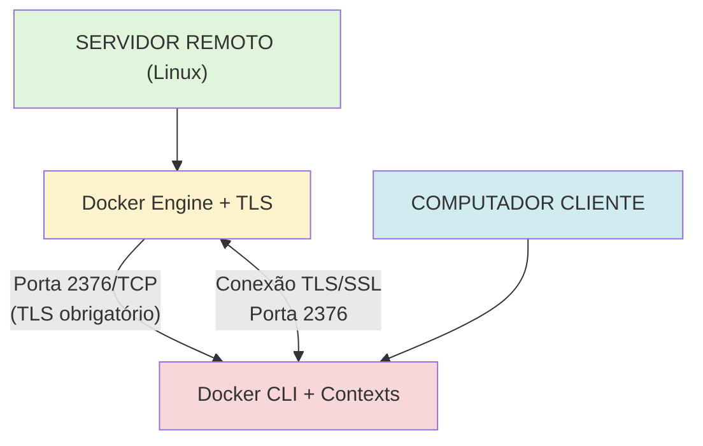

# Docker Remoto com TLS - Guia Completo

Este guia descreve como instalar e configurar o Docker com acesso remoto seguro usando TLS (Transport Layer Security). O processo é dividido em duas partes: instalação no servidor remoto e configuração no cliente.

## 📋 Índice

- [Visão Geral](#visão-geral)
- [Arquitetura](#arquitetura)
- [Pré-requisitos](#pré-requisitos)
- [Parte 1: Servidor Remoto](#parte-1-servidor-remoto)
  - [O que o Script Instala](#o-que-o-script-instala)
  - [O que o Script Configura](#o-que-o-script-configura)
  - [Instalação Passo a Passo](#instalação-passo-a-passo)
- [Parte 2: Computador Cliente](#parte-2-computador-cliente)
  - [O que o Script Faz](#o-que-o-script-faz-no-cliente)
  - [Configuração Passo a Passo](#configuração-passo-a-passo)
- [Uso Prático](#uso-prático)
- [Solução de Problemas](#solução-de-problemas)
- [Segurança](#segurança)
- [Referências](#referências)

## 🎯 Visão Geral

Este projeto fornece dois scripts automatizados para configurar Docker com acesso remoto seguro via TLS:

1. **`install-docker-remote.sh`** - Executado no servidor Ubuntu para instalar Docker e configurar acesso remoto seguro
2. **`setup-docker-remote.sh`** - Executado no cliente para configurar conexão remota usando Docker Contexts

**Principais Características:**
- ✅ Instalação automatizada do Docker Engine
- ✅ Configuração TLS com certificados auto-assinados
- ✅ Uso de Docker Contexts para gerenciar múltiplos hosts
- ✅ Suporte a Dockly (dashboard CLI interativo)
- ✅ Configuração automática de firewall
- ✅ Validação e testes integrados

## 🏗️ Arquitetura



**Componentes:**
- **Servidor**: Docker Engine configurado para aceitar conexões remotas via TLS
- **Cliente**: Docker CLI configurado com certificados TLS para conectar ao servidor
- **Comunicação**: Criptografada via TLS/SSL na porta 2376
- **Gerenciamento**: Docker Contexts para alternar entre diferentes hosts

## 🔧 Pré-requisitos

### Servidor Remoto

- **Sistema Operacional**: Ubuntu 20.04 LTS ou superior
- **Acesso**: Usuário com privilégios `sudo`
- **Conectividade**: Porta 2376 aberta/acessível na rede
- **Armazenamento**: `/var/lib/docker` precisa residir em filesystem Linux (ext4, xfs ou btrfs). O script interrompe caso detecte NTFS/SMB para evitar problemas de permissões.
- **Pacotes** (instalados automaticamente pelo script):
  - `curl` - Download de recursos
  - `ca-certificates` - Certificados de autoridade
  - `gnupg` - Gerenciamento de chaves GPG
  - `lsb-release` - Informações da distribuição Linux
  - `openssl` - Geração de certificados TLS
  - Imagem `busybox:1.36.1` (baixada automaticamente para testes de permissão)

### Computador Cliente

- **Docker CLI**: Instalado localmente (o script pode instalar automaticamente)
- **Conectividade**: Acesso de rede ao servidor na porta 2376
- **Certificados**: Copiados do servidor (automatizado via SSH/SCP)
- **Sistemas Suportados**: Linux, macOS, Windows (com WSL2)
- **Pacotes Necessários**:
  - `openssl` - Validação de certificados
  - `curl` - Download de recursos
  - `sshpass` (opcional) - Autenticação SSH com senha

---

# PARTE 1: SERVIDOR REMOTO

Execute esta parte **no servidor Linux** onde o Docker será instalado.

## 🎯 O que o Script Instala

O script `install-docker-remote.sh` instala e configura automaticamente:

### 1. **Docker Engine e Componentes**
- **Docker Engine** (`docker-ce`) - Motor de execução de containers
- **Docker CLI** (`docker-ce-cli`) - Interface de linha de comando
- **Containerd** (`containerd.io`) - Runtime de containers
- **Docker Buildx Plugin** - Build avançado de imagens (multi-plataforma)
- **Docker Compose Plugin** - Orquestração de multi-containers

### 2. **Dependências do Sistema**
- `curl` - Cliente HTTP para downloads
- `ca-certificates` - Certificados raiz confiáveis
- `gnupg` - GNU Privacy Guard para validação de assinaturas
- `lsb-release` - Informações da distribuição Linux
- `openssl` - Toolkit de criptografia SSL/TLS

### 3. **Certificados TLS** (Auto-assinados)
- **Certificate Authority (CA)** própria:
  - `ca-key.pem` - Chave privada da CA (4096 bits, AES-256)
  - `ca.pem` - Certificado raiz da CA (validade: 365 dias)
- **Certificados do Servidor**:
  - `server-key.pem` - Chave privada do servidor (4096 bits)
  - `server-cert.pem` - Certificado do servidor (SHA-256, com SAN)
- **Certificados do Cliente**:
  - `key.pem` - Chave privada do cliente (4096 bits)
  - `cert.pem` - Certificado do cliente (SHA-256)

### 4. **Ferramentas Opcionais**
- **NVM** (Node Version Manager) - Gerenciador de versões do Node.js
- **Node.js** - Runtime JavaScript (versão mais recente via nvm)
- **npm** - Gerenciador de pacotes do Node.js
- **Dockly** - Dashboard interativo CLI para gerenciamento Docker

#### Sobre o Dockly

> **Dockly** é uma ferramenta de dashboard interativo para Docker, acessível via terminal. Permite visualizar, gerenciar e interagir com containers, imagens, volumes e redes de forma intuitiva, tudo em modo texto. Ideal para administradores que preferem uma interface rápida sem depender de GUIs pesadas.

**Recursos do Dockly:**
- 📊 Visualização em tempo real de containers, imagens, volumes e redes
- 🔄 Iniciar, parar e remover containers
- 📝 Visualizar logs em tempo real
- 💻 Executar comandos dentro de containers
- 📈 Monitorar uso de recursos (CPU, memória)

## ⚙️ O que o Script Configura

### 1. **Docker Daemon** (`/etc/docker/daemon.json`)
```json
{
  "hosts": [
    "unix:///var/run/docker.sock",  // Socket local (mantém compatibilidade)
    "tcp://0.0.0.0:2376"             // Escuta remota TLS na porta 2376
  ],
  "tls": true,                        // Habilita TLS
  "tlscacert": "/etc/docker/certs/ca.pem",
  "tlscert": "/etc/docker/certs/server-cert.pem",
  "tlskey": "/etc/docker/certs/server-key.pem",
  "tlsverify": true                   // Exige verificação mútua TLS
}
```

**Configurações aplicadas:**
- ✅ Acesso local via socket Unix (`/var/run/docker.sock`)
- ✅ Acesso remoto na porta 2376 com TLS obrigatório
- ✅ Verificação mútua de certificados (cliente e servidor)
- ✅ Criptografia TLS 1.2+ para toda comunicação remota

### 2. **Systemd Override** (`/etc/systemd/system/docker.service.d/override.conf`)
```ini
[Service]
ExecStart=
ExecStart=/usr/bin/dockerd --containerd=/run/containerd/containerd.sock
```

**Motivo:** Remove conflitos entre `daemon.json` e parâmetros de linha de comando do systemd.

### 3. **Firewall (UFW)**
```bash
sudo ufw allow 2376/tcp
```

**Configuração:**
- ✅ Libera porta 2376/TCP para conexões remotas TLS
- ⚠️ Apenas se UFW estiver ativo (caso contrário, requer configuração manual)

### 4. **Grupos e Permissões**
- Adiciona usuário ao grupo `docker` para acesso sem `sudo`
- Ajusta permissões dos certificados:
  - Chaves privadas: `0400` (leitura apenas pelo proprietário)
  - Certificados públicos: `0444` (leitura por todos)

### 5. **Certificados do Cliente**
- Copia certificados para `~/docker-client-certs/` para transferência ao cliente
- Arquivos: `ca.pem`, `cert.pem`, `key.pem`
- Executa automaticamente um teste com volume temporário + `chown 10001:0` para garantir compatibilidade com containers MSSQL não-root.

## 📥 Instalação Passo a Passo

### 1️⃣ Download do Repositório

```bash
# Clonar repositório
git clone https://github.com/devopsvanilla/.BatOps.git
cd .BatOps/docker

# Ou se já tiver o repositório
cd /caminho/para/.BatOps/docker
```

### 2️⃣ Dar Permissão de Execução

```bash
chmod +x install-docker-remote.sh
```

### 3️⃣ Executar o Script

```bash
sudo ./install-docker-remote.sh
```

### 4️⃣ Fluxo de Instalação

O script executa automaticamente:

1. **Verificação de Requisitos**
   - ✅ Confirma que é Ubuntu
   - ✅ Verifica se está rodando com `sudo`
   - ✅ Detecta pacotes faltantes
   - ❓ Pergunta se deseja instalar dependências faltantes

2. **Detecção de Ambiente**
   - 🔍 Captura hostname do servidor
   - 🔍 Identifica IP da interface de rede principal (`ip route get`)
   - 📝 Exibe informações detectadas

3. **Instalação do Docker** (se não instalado)
   - 📦 Adiciona repositório oficial do Docker
   - 📦 Instala Docker Engine, CLI, plugins (Buildx, Compose)
   - 👥 Cria grupo `docker` e adiciona usuário

4. **Geração de Certificados TLS**
   - 🔐 Cria CA privada com chave AES-256 (4096 bits)
   - 🔐 Gera certificado servidor com SAN (hostname + IP + localhost)
   - 🔐 Gera certificado cliente com extensão `clientAuth`
   - 🗑️ Remove arquivos temporários (CSRs, extensões)
   - 🔒 Ajusta permissões de segurança

5. **Configuração do Docker Daemon**
   - ⚙️ Cria `/etc/docker/daemon.json` com configuração TLS
   - ⚙️ Cria override do systemd
   - 🔄 Recarrega daemon e reinicia Docker

6. **Configuração de Firewall**
   - 🔥 Libera porta 2376/TCP no UFW (se ativo)

7. **Preparação de Certificados**
   - 📂 Copia certificados para `~/docker-client-certs`
   - 🔒 Ajusta permissões apropriadas
  - 🧪 Cria um volume temporário e executa `chown 10001:0` via BusyBox para validar o filesystem

8. **Instalação do Dockly** (opcional)
   - ❓ Pergunta se deseja instalar
   - 📦 Instala nvm, Node.js, npm
   - 📦 Instala Dockly via npm global
   - ❓ Oferece testar Dockly

### 5️⃣ Verificar a Instalação

```bash
# Verificar status do Docker
sudo systemctl status docker

# Testar Docker localmente
docker ps
docker version

# Verificar porta TLS escutando
sudo netstat -tlnp | grep 2376
# ou
sudo ss -tlnp | grep dockerd
```

**Output esperado:**
```
tcp6       0      0 :::2376                 :::*                    LISTEN      1234/dockerd
```

### 6️⃣ Testar Docker Localmente

```bash
# Rodar container de teste
docker run hello-world

# Verificar informações
docker info
```

### 7️⃣ Preparar Certificados para o Cliente

Os certificados do cliente foram salvos em:
```
~/docker-client-certs/
├── ca.pem          # Certificado da CA
├── cert.pem        # Certificado do cliente
└── key.pem         # Chave privada do cliente
```

**Próximo passo**: Copie estes 3 arquivos para o computador cliente (veja Parte 2).

---

# PARTE 2: COMPUTADOR CLIENTE

Execute esta parte **no seu computador** (Linux, macOS ou Windows/WSL2) que deseja usar Docker remoto.

## 🎯 O que o Script Faz (no Cliente)

O script `setup-docker-remote.sh` realiza:

### 1. **Limpeza de Configurações Antigas**
- Remove variáveis de ambiente `DOCKER_HOST`, `DOCKER_TLS_VERIFY`, `DOCKER_CERT_PATH` de `~/.bashrc` e `~/.zshrc`
- Limpa variáveis da sessão atual
- Garante configuração limpa usando Docker Contexts

### 2. **Verificação de Requisitos**
- Verifica se `docker` CLI está instalado
- Oferece instalar Docker CLI se ausente (apenas CLI, sem daemon)
- Verifica pacotes: `openssl`, `curl`
- Instala automaticamente dependências faltantes

### 3. **Detecção de Ambientes**
- Detecta se existe Docker local rodando
- Detecta configurações remotas existentes
- Oferece menu interativo para escolher modo de operação

### 4. **Configuração de Novo Servidor Remoto**
- Solicita IP do servidor Docker
- Solicita usuário SSH
- Oferece autenticação via senha ou chave SSH
- Testa conectividade (ping)
- Copia certificados automaticamente via SCP/SFTP
- Ajusta permissões dos certificados
- Salva configuração em `~/.docker/remote-docker-host.conf`

### 5. **Docker Contexts**
- Cria Docker Context com nome `remote-<IP>`
- Configura Context com certificados TLS
- Permite trocar entre contexts facilmente
- Testa conexão automática após criação

### 6. **Validação**
- Testa conexão executando `docker version`
- Exibe informações do servidor remoto
- Lista contexts disponíveis
- Executa automaticamente um teste de volume remoto (BusyBox + `chown 10001:0`) para garantir compatibilidade antes de usar o contexto

## 📥 Configuração Passo a Passo

### 1️⃣ Pré-requisito: Docker CLI

O script pode instalar automaticamente. Se preferir instalar manualmente:

#### No Linux (Ubuntu/Debian)

```bash
# Adicionar repositório
curl -fsSL https://download.docker.com/linux/ubuntu/gpg | sudo gpg --dearmor -o /usr/share/keyrings/docker-archive-keyring.gpg

echo "deb [arch=amd64 signed-by=/usr/share/keyrings/docker-archive-keyring.gpg] https://download.docker.com/linux/ubuntu $(lsb_release -cs) stable" | sudo tee /etc/apt/sources.list.d/docker.list > /dev/null

# Instalar apenas CLI
sudo apt-get update
sudo apt-get install -y docker-ce-cli
```

#### No macOS

```bash
brew install docker
```

#### No Windows (WSL2)

Execute os mesmos comandos do Linux dentro do WSL2.

### 2️⃣ Download do Script

```bash
# Clonar repositório no cliente
git clone https://github.com/devopsvanilla/.BatOps.git
cd .BatOps/docker

# Ou se já tiver
cd /caminho/para/.BatOps/docker
```

### 3️⃣ Executar o Script de Setup

```bash
chmod +x setup-docker-remote.sh
./setup-docker-remote.sh
```

### 4️⃣ Fluxo Interativo

O script apresenta um menu interativo:

**Cenário 1: Apenas Docker Local Detectado**
```
Docker local detectado. Deseja configurar Docker remoto? (s/N):
```

**Cenário 2: Docker Local + Remoto Configurado**
```
Qual Docker você deseja usar?
  1) Docker Local
  2) Docker Remoto (192.168.1.100)
  3) Configurar novo Docker Remoto
Escolha (1/2/3):
```

**Cenário 3: Apenas Remoto Configurado**
```
Configuração remota existente: 192.168.1.100
  1) Usar configuração existente
  2) Configurar novo servidor
Escolha (1/2):
```

### 5️⃣ Configuração de Novo Servidor

Se escolher configurar novo servidor:

```bash
Digite o IP do servidor Docker remoto: 192.168.1.100
Digite o usuário SSH do servidor [devopsvanilla]: 
Digite a senha SSH (ou ENTER para usar chave SSH): [senha oculta]
```

O script então:
1. ✅ Testa conectividade (ping)
2. ✅ Cria diretório `~/docker/<IP>/docker-client-certs`
3. ✅ Copia certificados via SCP automaticamente
4. ✅ Ajusta permissões (`0400` para key.pem, `0444` para ca.pem e cert.pem)
5. ✅ Cria Docker Context `remote-<IP>`
6. ✅ Testa conexão
7. ✅ Exibe informações de sucesso

### 6️⃣ Configuração Manual de Certificados (Opcional)

Se preferir copiar certificados manualmente:

```bash
# Criar diretório
mkdir -p ~/docker/certs

# Copiar via SCP
scp usuario@IP_SERVIDOR:~/docker-client-certs/* ~/docker/certs/

# Ajustar permissões
chmod 0400 ~/docker/certs/key.pem
chmod 0444 ~/docker/certs/ca.pem ~/docker/certs/cert.pem

# Criar context manualmente
docker context create remote-docker \
  --docker "host=tcp://IP_SERVIDOR:2376,ca=~/docker/certs/ca.pem,cert=~/docker/certs/cert.pem,key=~/docker/certs/key.pem"
```

---

# USO PRÁTICO

## 🎮 Gerenciamento de Docker Contexts

Docker Contexts permitem alternar facilmente entre diferentes hosts Docker.

### Listar Contexts Disponíveis

```bash
docker context ls
```

**Output esperado:**
```
NAME                DESCRIPTION                     DOCKER ENDPOINT
default             Current DOCKER_HOST             unix:///var/run/docker.sock
remote-192.168.1.100 Docker remoto em 192.168.1.100 tcp://192.168.1.100:2376
```

### Trocar para Docker Remoto

```bash
# Ativar context remoto
docker context use remote-192.168.1.100

# Agora todos os comandos vão para o servidor remoto
docker ps
docker images
docker info
```

### Voltar para Docker Local

```bash
docker context use default
```

### Usar Context Temporariamente (Sem Trocar)

```bash
# Executar comando em context específico
docker -c remote-192.168.1.100 ps
docker -c remote-192.168.1.100 images
```

### Inspecionar um Context

```bash
docker context inspect remote-192.168.1.100
```

### Remover um Context

```bash
docker context rm remote-192.168.1.100
```

## 📦 Exemplos Práticos

### Executar Container Remoto

```bash
# Ativar context remoto
docker context use remote-192.168.1.100

# Executar Nginx
docker run -d -p 8080:80 --name webserver nginx

# Verificar
docker ps

# Acessar logs
docker logs -f webserver
```

### Docker Compose Remoto

```bash
# Ativar context remoto
docker context use remote-192.168.1.100

# Deploy com Compose
docker compose -f docker-compose.yml up -d

# Ver status
docker compose ps

# Ver logs
docker compose logs -f
```

### Copiar Arquivos para/de Container Remoto

```bash
# Ativar context remoto
docker context use remote-192.168.1.100

# Copiar arquivo local para container
docker cp arquivo.txt container_id:/path/to/file

# Copiar arquivo de container para local
docker cp container_id:/path/to/file arquivo.txt
```

### Executar Comando em Container Remoto

```bash
# Ativar context remoto
docker context use remote-192.168.1.100

# Executar shell interativo
docker exec -it container_id bash

# Executar comando único
docker exec container_id ls -la /var/www
```

### Build de Imagem Remoto

```bash
# Ativar context remoto
docker context use remote-192.168.1.100

# Build de imagem no servidor remoto
docker build -t minha-app:latest .

# Push para registry
docker push minha-app:latest
```

## 🔄 Método Alternativo: Variáveis de Ambiente (Legado)

**Nota:** Docker Contexts é o método recomendado. Use variáveis de ambiente apenas se necessário.

### Temporário (Apenas Sessão Atual)

```bash
export DOCKER_HOST=tcp://192.168.1.100:2376
export DOCKER_TLS_VERIFY=1
export DOCKER_CERT_PATH=~/docker/192.168.1.100/docker-client-certs

# Agora docker usa o servidor remoto
docker ps
docker version
```

### Permanente (Adicionar ao ~/.bashrc ou ~/.zshrc)

```bash
# Para bash
echo 'export DOCKER_HOST=tcp://192.168.1.100:2376' >> ~/.bashrc
echo 'export DOCKER_TLS_VERIFY=1' >> ~/.bashrc
echo 'export DOCKER_CERT_PATH=~/docker/192.168.1.100/docker-client-certs' >> ~/.bashrc
source ~/.bashrc

# Para zsh
echo 'export DOCKER_HOST=tcp://192.168.1.100:2376' >> ~/.zshrc
echo 'export DOCKER_TLS_VERIFY=1' >> ~/.zshrc
echo 'export DOCKER_CERT_PATH=~/docker/192.168.1.100/docker-client-certs' >> ~/.zshrc
source ~/.zshrc
```

### Limpar Variáveis de Ambiente

```bash
unset DOCKER_HOST
unset DOCKER_TLS_VERIFY
unset DOCKER_CERT_PATH
```

## 🔧 Método Alternativo: Parâmetros na Linha de Comando

```bash
docker --tlsverify \
  --tlscacert=~/docker/certs/ca.pem \
  --tlscert=~/docker/certs/cert.pem \
  --tlskey=~/docker/certs/key.pem \
  -H=tcp://192.168.1.100:2376 \
  ps
```

---

# SOLUÇÃO DE PROBLEMAS

## 🔍 Diagnóstico Geral

### Verificar Context Atual

```bash
docker context show
```

### Verificar Configuração do Context

```bash
docker context inspect <context_name>
```

### Testar Conectividade Manual

```bash
# Com ping
ping -c 3 192.168.1.100

# Com telnet
telnet 192.168.1.100 2376

# Com OpenSSL
openssl s_client -connect 192.168.1.100:2376 \
  -CAfile ~/docker/certs/ca.pem \
  -cert ~/docker/certs/cert.pem \
  -key ~/docker/certs/key.pem
```

## ❌ Erro: "Cannot connect to the Docker daemon"

**Possíveis Causas:**
- Docker não está rodando no servidor
- Firewall bloqueando porta 2376
- Context incorreto selecionado
- Certificados incorretos

**Soluções:**

### 1. Verificar Docker no Servidor

```bash
# No servidor
sudo systemctl status docker
sudo systemctl restart docker

# Ver logs
sudo journalctl -xeu docker.service
```

### 2. Verificar Porta no Servidor

```bash
# No servidor
sudo netstat -tlnp | grep 2376
sudo ss -tlnp | grep dockerd

# Deve mostrar:
# tcp6  0  0 :::2376  :::*  LISTEN  1234/dockerd
```

### 3. Verificar Firewall no Servidor

```bash
# No servidor
sudo ufw status

# Se bloqueado, liberar
sudo ufw allow 2376/tcp
sudo ufw reload
```

### 4. Verificar Context no Cliente

```bash
# No cliente
docker context ls
docker context use remote-192.168.1.100
```

## ❌ Erro: "certificate signed by unknown authority"

**Causa:** Certificados incorretos ou caminho errado.

**Soluções:**

### 1. Verificar Certificados Existem

```bash
ls -la ~/docker/certs/
# ou
ls -la ~/docker/192.168.1.100/docker-client-certs/
```

### 2. Verificar Permissões

```bash
chmod 0400 ~/docker/certs/key.pem
chmod 0444 ~/docker/certs/ca.pem ~/docker/certs/cert.pem
```

### 3. Validar Certificados

```bash
# Verificar certificado do cliente
openssl x509 -in ~/docker/certs/cert.pem -text -noout

# Verificar expiração
openssl x509 -in ~/docker/certs/cert.pem -noout -dates

# Validar chain
openssl verify -CAfile ~/docker/certs/ca.pem ~/docker/certs/cert.pem
```

### 4. Recriar Context

```bash
# Remover context antigo
docker context rm remote-192.168.1.100

# Criar novamente
docker context create remote-192.168.1.100 \
  --docker "host=tcp://192.168.1.100:2376,ca=~/docker/certs/ca.pem,cert=~/docker/certs/cert.pem,key=~/docker/certs/key.pem"
```

## ❌ Erro: "connection refused"

**Causa:** Firewall bloqueando ou Docker não escutando.

**Soluções:**

### 1. Teste no Servidor

```bash
# No servidor, verificar se está escutando
sudo ss -tlnp | grep 2376

# Testar localmente no servidor
curl --insecure https://localhost:2376/_ping
```

### 2. Verificar daemon.json

```bash
# No servidor
sudo cat /etc/docker/daemon.json
```

**Deve conter:**
```json
{
  "hosts": ["unix:///var/run/docker.sock", "tcp://0.0.0.0:2376"],
  "tls": true,
  "tlsverify": true,
  ...
}
```

### 3. Verificar Override do Systemd

```bash
# No servidor
sudo cat /etc/systemd/system/docker.service.d/override.conf
```

**Deve conter:**
```ini
[Service]
ExecStart=
ExecStart=/usr/bin/dockerd --containerd=/run/containerd/containerd.sock
```

### 4. Reiniciar Docker

```bash
# No servidor
sudo systemctl daemon-reload
sudo systemctl restart docker
```

## ❌ Erro: "Permission denied while trying to connect"

**Causa:** Permissões de certificado incorretas ou usuário não no grupo docker.

**Soluções:**

### 1. Ajustar Permissões de Certificados

```bash
chmod 0400 ~/docker/certs/key.pem
chmod 0444 ~/docker/certs/ca.pem ~/docker/certs/cert.pem
```

### 2. Adicionar Usuário ao Grupo Docker (No Servidor)

```bash
# No servidor
sudo usermod -aG docker $USER

# Fazer logout/login
exit
# (reconectar via SSH)

# Verificar
id -nG | grep docker
```

## ❌ Certificados Expirados

**Verificar Expiração:**

```bash
# No cliente
openssl x509 -in ~/docker/certs/cert.pem -noout -dates

# No servidor
sudo openssl x509 -in /etc/docker/certs/server-cert.pem -noout -dates
```

**Solução:** Regenerar certificados no servidor executando novamente `install-docker-remote.sh` e copiar novos certificados para cliente.

## ❌ Erro: "x509: cannot validate certificate"

**Causa:** SAN (Subject Alternative Name) não inclui IP ou hostname usado.

**Verificar SAN:**

```bash
# No servidor
sudo openssl x509 -in /etc/docker/certs/server-cert.pem -text -noout | grep -A1 "Subject Alternative Name"
```

**Deve mostrar:**
```
X509v3 Subject Alternative Name:
    DNS:hostname, IP Address:192.168.1.100, IP Address:127.0.0.1
```

**Solução:** Regenerar certificados no servidor com o IP/hostname correto.

## ⚠️ Docker Local e Remoto Conflitando

**Sintoma:** Comandos docker não funcionam após configurar remoto.

**Solução:**

```bash
# Verificar context atual
docker context show

# Trocar para local
docker context use default

# Verificar
docker ps
```

## 🧹 Limpar Configuração e Recomeçar

```bash
# No cliente
# Remover todos os contexts remotos
docker context rm $(docker context ls -q | grep -v default)

# Limpar variáveis de ambiente
unset DOCKER_HOST DOCKER_TLS_VERIFY DOCKER_CERT_PATH

# Remover configuração
rm -f ~/.docker/remote-docker-host.conf

# Remover certificados (se necessário)
rm -rf ~/docker/*/docker-client-certs

# Executar setup novamente
./setup-docker-remote.sh
```

---

# SEGURANÇA

## 🔒 Boas Práticas

### 1. **Proteção de Certificados** ⚠️

**Crítico:**
- ❌ **NUNCA** compartilhe `key.pem` publicamente
- ❌ **NUNCA** commite certificados em repositórios Git
- ✅ Armazene certificados em local seguro (criptografado se possível)
- ✅ Use permissões restritivas (`0400` para chaves privadas)

```bash
# Verificar permissões
ls -la ~/docker/certs/

# Corrigir se necessário
chmod 0400 ~/docker/certs/key.pem
chmod 0444 ~/docker/certs/ca.pem ~/docker/certs/cert.pem
```

### 2. **Firewall** 🔥

Limite acesso à porta 2376 apenas a IPs confiáveis:

```bash
# No servidor - Remover regra genérica
sudo ufw delete allow 2376/tcp

# Adicionar regras específicas por IP
sudo ufw allow from 192.168.1.50 to any port 2376 proto tcp
sudo ufw allow from 192.168.1.51 to any port 2376 proto tcp

# Ou por subnet
sudo ufw allow from 192.168.1.0/24 to any port 2376 proto tcp

# Verificar
sudo ufw status numbered
```

### 3. **Monitoramento** 📊

Monitore acessos e atividades:

```bash
# No servidor - Ver logs do Docker
sudo journalctl -u docker.service -f

# Filtrar conexões TLS
sudo journalctl -u docker.service | grep "TLS"

# Ver conexões ativas
sudo netstat -tnp | grep :2376

# Logs de autenticação
sudo tail -f /var/log/auth.log | grep docker
```

### 4. **Rotação de Certificados** 🔄

Certificados gerados são válidos por **365 dias**.

**Verificar Expiração:**

```bash
# No servidor
sudo openssl x509 -in /etc/docker/certs/server-cert.pem -noout -enddate

# No cliente
openssl x509 -in ~/docker/certs/cert.pem -noout -enddate
```

**Renovar Certificados:**

```bash
# No servidor
sudo ./install-docker-remote.sh
# (Escolher apenas configuração TLS)

# Copiar novos certificados para clientes
scp ~/docker-client-certs/* usuario@cliente:~/docker/certs/

# No cliente - Recriar context
docker context rm remote-192.168.1.100
./setup-docker-remote.sh
```

### 5. **Atualizações** 📦

Mantenha Docker atualizado:

```bash
# No servidor
sudo apt-get update
sudo apt-get install --only-upgrade docker-ce docker-ce-cli containerd.io

# Verificar versão
docker version
```

### 6. **Auditoria de Acessos**

Habilite auditoria detalhada:

```bash
# No servidor - Editar daemon.json
sudo nano /etc/docker/daemon.json
```

Adicionar:
```json
{
  ...
  "log-level": "info",
  "log-driver": "json-file",
  "log-opts": {
    "max-size": "10m",
    "max-file": "3"
  }
}
```

```bash
# Reiniciar Docker
sudo systemctl restart docker
```

### 7. **Revogar Acesso de Cliente**

Para bloquear um cliente específico:

**Opção 1: Regenerar CA** (bloqueia todos)
```bash
# No servidor
sudo ./install-docker-remote.sh
# Distribuir novos certificados apenas para clientes autorizados
```

**Opção 2: Firewall** (bloquear IP específico)
```bash
# No servidor
sudo ufw deny from 192.168.1.50 to any port 2376
```

### 8. **Certificados em Produção**

Para ambientes de produção, considere:

- ✅ Usar CA confiável (Let's Encrypt, CA interna)
- ✅ Implementar mutual TLS (mTLS) com validação rigorosa
- ✅ Usar ferramentas de gestão de certificados (Vault, cert-manager)
- ✅ Implementar rotação automática de certificados
- ✅ Monitorar expiração com alertas automatizados

### 9. **Princípio do Menor Privilégio**

```bash
# No servidor
# Criar usuário dedicado apenas para Docker
sudo useradd -m -s /bin/bash dockeruser
sudo usermod -aG docker dockeruser

# Usar esse usuário para conexões remotas
# Evitar usar usuário com sudo
```

### 10. **Network Segmentation**

Coloque Docker em subnet separada:

```bash
# No servidor - Configurar rede isolada
# /etc/docker/daemon.json
{
  ...
  "bip": "172.26.0.1/16",
  "default-address-pools": [
    {"base": "172.27.0.0/16", "size": 24}
  ]
}
```

---

# REFERÊNCIAS

## 📚 Documentação Oficial

### Docker
- [Protect the Docker daemon socket](https://docs.docker.com/engine/security/protect-access/) - Documentação oficial sobre segurança do daemon Docker
- [Docker TLS Configuration](https://docs.docker.com/engine/security/https/) - Guia completo de configuração TLS
- [Docker Context Documentation](https://docs.docker.com/engine/context/working-with-contexts/) - Documentação sobre Docker Contexts
- [Docker Daemon Configuration](https://docs.docker.com/engine/reference/commandline/dockerd/#daemon-configuration-file) - Referência do daemon.json
- [Docker Compose](https://docs.docker.com/compose/) - Documentação oficial do Docker Compose
- [Docker CLI Reference](https://docs.docker.com/engine/reference/commandline/cli/) - Referência completa da CLI

### OpenSSL
- [OpenSSL Documentation](https://www.openssl.org/docs/) - Documentação oficial do OpenSSL
- [OpenSSL Command-Line Howto](https://www.madboa.com/geek/openssl/) - Guia prático de comandos
- [X.509 Certificates](https://datatracker.ietf.org/doc/html/rfc5280) - RFC 5280 - Padrão de certificados

### Segurança
- [Docker Security Best Practices](https://docs.docker.com/engine/security/) - Práticas recomendadas de segurança
- [CIS Docker Benchmark](https://www.cisecurity.org/benchmark/docker) - Benchmark de segurança para Docker
- [NIST Container Security Guide](https://nvlpubs.nist.gov/nistpubs/SpecialPublications/NIST.SP.800-190.pdf) - Guia de segurança para containers

## 🛠️ Ferramentas Utilizadas

### Dockly
- [Dockly - GitHub](https://github.com/lirantal/dockly) - Dashboard interativo CLI para Docker
- [Dockly - npm](https://www.npmjs.com/package/dockly) - Pacote npm oficial

### NVM (Node Version Manager)
- [NVM - GitHub](https://github.com/nvm-sh/nvm) - Node Version Manager
- [NVM Installation Guide](https://github.com/nvm-sh/nvm#installing-and-updating) - Guia de instalação

### Ferramentas de Sistema
- [UFW (Uncomplicated Firewall)](https://help.ubuntu.com/community/UFW) - Firewall simplificado para Ubuntu
- [Systemd](https://systemd.io/) - System and service manager
- [OpenSSH](https://www.openssh.com/) - Conectividade segura

## 📖 Tutoriais e Artigos

### Docker Remoto
- [How to Set Up a Remote Docker Daemon](https://www.howtogeek.com/devops/how-to-set-up-a-remote-docker-daemon/) - Tutorial prático
- [Secure Docker Remote API](https://medium.com/@ssmak/how-to-enable-docker-remote-api-on-docker-host-7b73bd3278c6) - Artigo detalhado
- [Docker Contexts Deep Dive](https://www.docker.com/blog/how-to-deploy-on-remote-docker-hosts-with-docker-compose/) - Blog oficial Docker

### Certificados TLS
- [Understanding TLS Certificates](https://www.digicert.com/what-is-ssl-tls-https) - Guia sobre TLS/SSL
- [Self-Signed Certificates](https://www.digitalocean.com/community/tutorials/openssl-essentials-working-with-ssl-certificates-private-keys-and-csrs) - Tutorial Digital Ocean
- [Certificate Authority (CA) Basics](https://www.ssl.com/faqs/what-is-a-certificate-authority/) - Fundamentos de CA

## 🔧 Troubleshooting Resources

- [Docker Troubleshooting Guide](https://docs.docker.com/config/daemon/troubleshoot/) - Guia oficial de troubleshooting
- [Common Docker Issues](https://stackoverflow.com/questions/tagged/docker) - Stack Overflow
- [Docker Forums](https://forums.docker.com/) - Fóruns oficiais Docker
- [Docker Subreddit](https://www.reddit.com/r/docker/) - Comunidade no Reddit

## 🎓 Cursos e Recursos de Aprendizado

- [Docker Official Training](https://www.docker.com/products/docker-training/) - Treinamento oficial
- [Play with Docker](https://labs.play-with-docker.com/) - Ambiente de prática online
- [Docker Curriculum](https://docker-curriculum.com/) - Tutorial interativo gratuito

## 🏢 Produção e Enterprise

- [Docker Enterprise Documentation](https://docs.docker.com/ee/) - Documentação Enterprise
- [Kubernetes](https://kubernetes.io/) - Orquestração de containers em produção
- [Docker Swarm](https://docs.docker.com/engine/swarm/) - Orquestração nativa do Docker
- [Portainer](https://www.portainer.io/) - Interface gráfica para gerenciamento Docker

## 📜 Padrões e Especificações

- [OCI (Open Container Initiative)](https://opencontainers.org/) - Padrões de containers
- [CNI (Container Network Interface)](https://github.com/containernetworking/cni) - Padrão de rede para containers
- [CRI (Container Runtime Interface)](https://kubernetes.io/docs/concepts/architecture/cri/) - Interface de runtime

---

## 📝 Resumo Rápido de Comandos

### No Servidor (Uma Única Vez)

```bash
# Clonar repositório
git clone https://github.com/devopsvanilla/.BatOps.git
cd .BatOps/docker

# Executar instalação
chmod +x install-docker-remote.sh
sudo ./install-docker-remote.sh

# Certificados salvos em:
# ~/docker-client-certs/
```

### No Cliente (Uma Única Vez)

```bash
# Clonar repositório
git clone https://github.com/devopsvanilla/.BatOps.git
cd .BatOps/docker

# Executar configuração
chmod +x setup-docker-remote.sh
./setup-docker-remote.sh

# Seguir menu interativo
```

### Uso Diário

```bash
# Ver contexts disponíveis
docker context ls

# Trocar para remoto
docker context use remote-192.168.1.100

# Usar normalmente
docker ps
docker images
docker run hello-world

# Voltar para local
docker context use default
```

---

**Última atualização**: Dezembro 2024  
**Versão**: 3.0 - Documentação completa regenerada  
**Autor**: DevOps Vanilla  
**Repositório**: [github.com/devopsvanilla/.BatOps](https://github.com/devopsvanilla/.BatOps)
