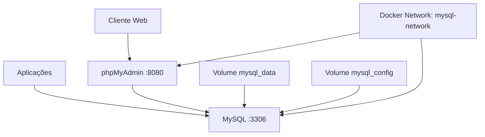

# MySQL com phpMyAdmin

⏱️ Tempo de leitura: ~12 minutos

## Propósito

Este projeto fornece uma solução completa para desenvolvimento e gerenciamento de banco de dados usando [MySQL](https://www.mysql.com/) com interface de administração [phpMyAdmin](https://www.phpmyadmin.net/), todos containerizados com [Docker Compose](https://docs.docker.com/compose/).

## Motivação

- **Setup simplificado**: Ambiente MySQL pronto para desenvolvimento em minutos
- **Interface gráfica**: phpMyAdmin para gerenciamento visual do banco de dados
- **Configurações otimizadas**: MySQL 8.0 com configurações de performance
- **Persistência garantida**: Volumes Docker para preservar dados
- **Isolamento seguro**: Rede interna para comunicação entre containers
- **Portabilidade completa**: Fácil migração entre ambientes

## Dependências

### Sistema Operacional

- **Linux** (Ubuntu, Debian, CentOS, RHEL, etc.) - Recomendado e testado
- **macOS** - Compatível
- **Windows** - Requer [WSL (Windows Subsystem for Linux)](https://docs.microsoft.com/en-us/windows/wsl/)

> ⚠️ **Importante para usuários Windows**: Este procedimento foi desenvolvido e testado para ambientes Linux. Para Windows, é **altamente recomendado** usar [WSL2](https://docs.microsoft.com/en-us/windows/wsl/install) para garantir compatibilidade total com os scripts bash e comandos Docker.

### Obrigatórias

- **Sistema operacional**: Linux ou WSL2 no Windows
- [Docker](https://www.docker.com/) >= 20.10
- [Docker Compose](https://docs.docker.com/compose/) >= 2.0

### Opcionais

- [Git](https://git-scm.com/) (para versionamento)
- Editor de texto para customizar configurações

## Diagrama da Solução



## Como Implantar e Configurar

> � **Estrutura do Projeto**: Este projeto faz parte do repositório [.BatOps](https://github.com/devopsvanilla/.BatOps) e está localizado no diretório `docker/mysql+pma/`. Todos os comandos devem ser executados a partir deste diretório específico.

### 0. Configuração para Windows (WSL)

Se estiver no Windows, configure o WSL primeiro:

```bash
# Instalar WSL2 (PowerShell como Administrador)
wsl --install

# Ou instalar distribuição específica
wsl --install -d Ubuntu

# Após instalação, entrar no WSL
wsl

# Instalar Docker no WSL
curl -fsSL https://get.docker.com -o get-docker.sh
sudo sh get-docker.sh
sudo usermod -aG docker $USER

# Reiniciar sessão WSL
exit
wsl
```

### 1. Preparação do Ambiente

```bash
# Ir para o diretório home
cd

# Clonar o repositório
git clone https://github.com/devopsvanilla/.BatOps.git

# Entrar diretamente no diretório da stack mysql+pma
cd .BatOps/docker/mysql+pma

# Copiar o arquivo de configuração de exemplo
cp .env.example .env
```

### 2. Personalizar Configurações

```bash
# Certificar-se de estar no diretório correto
pwd
# Deve mostrar: /home/seu_usuario/.BatOps/docker/mysql+pma

# Editar as variáveis conforme necessário
nano .env

# Ou usar outro editor de sua preferência
# vim .env
# code .env
```

### 3. Inicializar os Serviços

```bash
# IMPORTANTE: Execute todos os comandos a partir do diretório:
# /home/seu_usuario/.BatOps/docker/mysql+pma

# Criar e iniciar todos os containers
docker-compose up -d

# Verificar status dos containers
docker-compose ps

# Verificar logs em tempo real (opcional)
docker-compose logs -f
```

### 4. Configuração Inicial do phpMyAdmin

1. Acesse <http://localhost:8080>
2. Login: `root` / `[senha definida em MYSQL_ROOT_PASSWORD]`
3. Criar banco de dados conforme necessário

## Recursos Criados e Configurados

### Containers Docker

| Serviço | Imagem | Porta | Descrição |
|---------|--------|-------|-----------|
| mysql | mysql:8.0 | 3306 | Servidor de banco de dados |
| phpmyadmin | phpmyadmin:latest | 8080 | Interface de administração |

### Volumes Persistentes

| Volume | Finalidade | Localização |
|--------|------------|-------------|
| mysql_data | Dados do MySQL | /var/lib/mysql |
| mysql_config | Configurações MySQL | /etc/mysql/conf.d |

### Rede Docker

- **mysql-network**: Rede bridge interna para comunicação entre containers

### Variáveis de Ambiente (.env)

```bash
# MySQL Configuration
MYSQL_ROOT_PASSWORD=rootpassword123
MYSQL_DATABASE=testdb
MYSQL_USER=dbuser
MYSQL_PASSWORD=userpassword123
MYSQL_PORT=3306

# phpMyAdmin Configuration
PHPMYADMIN_PORT=8080
```

## Como Testar

### Teste de Conectividade

```bash
# Certificar-se de estar no diretório correto
cd ~/.BatOps/docker/mysql+pma

# Verificar se todos os containers estão rodando
docker-compose ps

# Testar phpMyAdmin
curl -f http://localhost:8080 || echo "phpMyAdmin não está respondendo"

# Testar conexão MySQL
docker-compose exec mysql mysql -u root -p -e "SELECT 'MySQL funcionando!' as status;"
```

### Teste Funcional

1. **phpMyAdmin**: Acesse <http://localhost:8080> e faça login
2. **MySQL**: Use phpMyAdmin para criar banco de dados de teste
3. **Persistência**: Reinicie os containers e verifique se os dados permanecem

```bash
# Teste de persistência
docker-compose restart
docker-compose ps
```

## Como Desinstalar

### Parar Serviços (Manter Dados)

```bash
docker-compose down
```

### Remover Completamente (Incluindo Dados)

```bash
# ATENÇÃO: Isso apagará todos os dados permanentemente
docker-compose down -v
docker-compose rm -f
```

### Limpeza de Imagens (Opcional)

```bash
docker image rm mysql:8.0 phpmyadmin:latest
```

## Problemas Comuns

### MySQL não conecta ou não inicia

**Sintomas**: Container MySQL não sobe ou erro de conexão

**Soluções**:

```bash
# Verificar se a porta 3306 não está em uso
sudo netstat -tlnp | grep :3306

# Verificar logs do MySQL
docker-compose logs mysql

# Aguardar inicialização completa
docker-compose restart mysql
```

### phpMyAdmin não carrega

**Sintomas**: Página em branco ou erro 502

**Soluções**:

```bash
# Verificar logs do phpMyAdmin
docker-compose logs phpmyadmin

# Aguardar MySQL estar completamente disponível
docker-compose restart phpmyadmin
```

### Portas em uso

**Sintomas**: Erro "port already in use"

**Soluções**:

```bash
# Verificar processos usando as portas
sudo netstat -tlnp | grep -E ':(3306|8080)'

# Alterar portas no docker-compose.yaml se necessário
```

### Volumes sem permissão

**Sintomas**: Erro de permissão nos volumes

**Soluções**:

```bash
# Ajustar permissões se necessário
sudo chown -R 999:999 /var/lib/docker/volumes/mysql*
```

### Problemas no Windows

**Sintomas**: Comandos bash não funcionam ou Docker não responde

**Soluções**:

```bash
# Verificar se está no WSL
wsl --status

# Verificar se Docker está rodando no WSL
docker --version
sudo service docker start

# Converter terminações de linha se necessário
dos2unix .env docker-compose.yaml
```

## Logs Gerados

| Nome do Log | Origem | Local de Armazenamento |
|-------------|--------|------------------------|
| mysql.log | Container MySQL | `docker-compose logs mysql` |
| phpmyadmin.log | Container phpMyAdmin | `docker-compose logs phpmyadmin` |
| docker-compose.log | Docker Compose | `docker-compose logs` |

### Comandos para Logs

```bash
# Todos os logs em tempo real
docker-compose logs -f

# Logs específicos de um serviço
docker-compose logs -f mysql

# Logs com timestamp
docker-compose logs -f -t

# Backup de logs
docker-compose logs mysql > mysql-backup.log
```

### Comandos de Administração

```bash
# Acessar shell do MySQL
docker-compose exec mysql mysql -u root -p

# Backup do banco
docker-compose exec mysql mysqldump -u root -p --all-databases > backup.sql

# Restore do banco  
docker-compose exec -i mysql mysql -u root -p < backup.sql

# Verificar status da stack
docker-compose ps
```

## Tecnologias de Terceiros Relacionadas

- **[MySQL](https://www.mysql.com/)**: Sistema de gerenciamento de banco de dados relacional
- **[phpMyAdmin](https://www.phpmyadmin.net/)**: Interface web para administração do MySQL
- **[Docker](https://www.docker.com/)**: Plataforma de containerização
- **[Docker Compose](https://docs.docker.com/compose/)**: Ferramenta para definir aplicações multi-container

## Isenção de Responsabilidade

Este projeto é fornecido "COMO ESTÁ" (AS-IS), sem garantias de qualquer tipo, expressas ou implícitas. O autor não se responsabiliza por danos, perda de dados ou problemas decorrentes do uso desta solução. Use por sua própria conta e risco.

**Recomendações**:

- Sempre faça backup dos dados antes de atualizações
- Teste em ambiente de desenvolvimento antes da produção
- Configure senhas seguras em ambiente produtivo
- Monitore logs e recursos do sistema regularmente
- Não exponha MySQL diretamente em produção

## Licenças

- **Este projeto**: [MIT License](https://opensource.org/licenses/MIT)
- **MySQL**: [GPL v2 License](https://www.mysql.com/about/legal/licensing/)
- **phpMyAdmin**: [GPL v2 License](https://www.phpmyadmin.net/license/)

## Autor

DevOps Vanilla

- GitHub: [@devopsvanilla](https://github.com/devopsvanilla)
- Projeto: [.BatOps](https://github.com/devopsvanilla/.BatOps)

---

Última atualização: Setembro 2025
