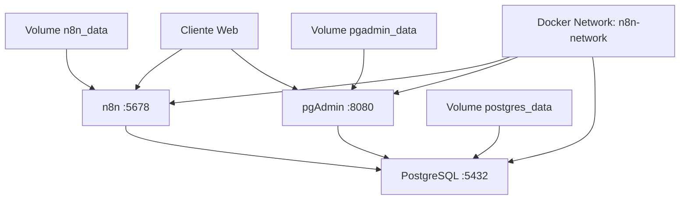

# n8n com PostgreSQL e pgAdmin

## Propósito

Este projeto fornece uma solução completa para automação de workflows usando [n8n](https://n8n.io/) com banco de dados [PostgreSQL](https://www.postgresql.org/) e interface de administração [pgAdmin](https://www.pgadmin.org/), todos containerizados com [Docker Compose](https://docs.docker.com/compose/).

## Motivação

- **Simplificar o setup**: Eliminar a necessidade de configurar servidores PostgreSQL externos
- **Ambiente integrado**: Todos os componentes necessários em uma única configuração
- **Portabilidade**: Fácil migração entre ambientes de desenvolvimento e produção
- **Administração visual**: Interface gráfica para gerenciar o banco de dados
- **Persistência de dados**: Volumes Docker garantem que os dados não sejam perdidos

## Dependências

### Obrigatórias

- [Docker](https://www.docker.com/) >= 20.10
- [Docker Compose](https://docs.docker.com/compose/) >= 2.0

### Opcionais

- [Git](https://git-scm.com/) (para versionamento)
- Editor de texto para customizar configurações

## Diagrama da Solução



## Como Implantar e Configurar

### 1. Preparação do Ambiente

```bash
# Clone ou navegue até o diretório
cd /home/devopsvanilla/.BatOps/docker/n8n/

# Copie o arquivo de configuração
cp .env.example .env
```

### 2. Personalizar Configurações

```bash
# Edite as variáveis conforme necessário
nano .env
```

### 3. Inicializar os Serviços

```bash
# Criar e iniciar todos os containers
docker-compose up -d

# Verificar status
docker-compose ps
```

### 4. Configuração Inicial do pgAdmin

1. Acesse <http://localhost:8080>
2. Login: `admin@n8n.local` / `pgadmin_password`
3. Adicionar servidor PostgreSQL:
   - Nome: `n8n-postgres`
   - Host: `postgres`
   - Porta: `5432`
   - Database: `n8n`
   - Usuário: `n8n`
   - Senha: `n8n_password`

## Recursos Criados e Configurados

### Containers Docker

| Serviço | Imagem | Porta | Descrição |
|---------|--------|-------|-----------|
| n8n | docker.n8n.io/n8nio/n8n:latest | 5678 | Plataforma de automação |
| postgres | postgres:16 | 5432 | Banco de dados |
| pgadmin | dpage/pgadmin4:latest | 8080 | Interface de administração |

### Volumes Persistentes

| Volume | Finalidade | Localização |
|--------|------------|-------------|
| n8n_data | Dados do n8n | /home/node/.n8n |
| postgres_data | Dados PostgreSQL | /var/lib/postgresql/data |
| pgadmin_data | Configurações pgAdmin | /var/lib/pgadmin |

### Rede Docker

- **n8n-network**: Rede bridge interna para comunicação entre containers

## Como Testar

### Teste de Conectividade

```bash
# Verificar se todos os containers estão rodando
docker-compose ps

# Testar n8n
curl -f http://localhost:5678 || echo "n8n não está respondendo"

# Testar pgAdmin
curl -f http://localhost:8080 || echo "pgAdmin não está respondendo"

# Testar conexão PostgreSQL
docker-compose exec postgres pg_isready -U n8n -d n8n
```

### Teste Funcional

1. **n8n**: Acesse <http://localhost:5678> e crie um workflow simples
2. **PostgreSQL**: Use pgAdmin para visualizar as tabelas criadas pelo n8n
3. **Persistência**: Reinicie os containers e verifique se os dados permanecem

## Como Desinstalar

### Parar Serviços (Manter Dados)

```bash
docker-compose down
```

### Remover Completamente (Incluindo Dados)

```bash
# ATENÇÃO: Isso apagará todos os dados permanentemente
docker-compose down -v
docker-compose rm -f
```

### Limpeza de Imagens (Opcional)

```bash
docker image rm docker.n8n.io/n8nio/n8n postgres:16 dpage/pgadmin4
```

## Problemas Comuns

### n8n não conecta no PostgreSQL

**Sintomas**: n8n não inicia ou erro de conexão com banco

**Soluções**:

```bash
# Verificar se PostgreSQL está saudável
docker-compose logs postgres

# Aguardar inicialização completa
docker-compose restart n8n
```

### pgAdmin não carrega

**Sintomas**: Página em branco ou erro 502

**Soluções**:

```bash
# Verificar logs
docker-compose logs pgadmin

# Limpar dados do pgAdmin se corrompidos
docker-compose down
docker volume rm n8n_pgadmin_data
docker-compose up -d
```

### Portas em uso

**Sintomas**: Erro "port already in use"

**Soluções**:

```bash
# Verificar processos usando as portas
sudo netstat -tlnp | grep -E ':(5678|8080|5432)'

# Alterar portas no docker-compose.yaml se necessário
```

### Volumes sem permissão

**Sintomas**: Erro de permissão nos volumes

**Soluções**:

```bash
# Ajustar permissões se necessário
sudo chown -R 1000:1000 /var/lib/docker/volumes/n8n_*
```

## Logs Gerados

| Nome do Log | Origem | Local de Armazenamento |
|-------------|--------|------------------------|
| n8n.log | Container n8n | `docker-compose logs n8n` |
| postgresql.log | Container postgres | `docker-compose logs postgres` |
| pgadmin.log | Container pgadmin | `docker-compose logs pgadmin` |
| docker-compose.log | Docker Compose | `docker-compose logs` |

### Comandos para Logs

```bash
# Todos os logs em tempo real
docker-compose logs -f

# Logs específicos de um serviço
docker-compose logs -f n8n

# Logs com timestamp
docker-compose logs -f -t
```

## Tecnologias de Terceiros Relacionadas

- **[n8n](https://n8n.io/)**: Plataforma de automação de workflows open-source
- **[PostgreSQL](https://www.postgresql.org/)**: Sistema de banco de dados relacional
- **[pgAdmin](https://www.pgadmin.org/)**: Ferramenta de administração para PostgreSQL
- **[Docker](https://www.docker.com/)**: Plataforma de containerização
- **[Docker Compose](https://docs.docker.com/compose/)**: Ferramenta para definir aplicações multi-container

## Isenção de Responsabilidade

Este projeto é fornecido "COMO ESTÁ" (AS-IS), sem garantias de qualquer tipo, expressas ou implícitas. O autor não se responsabiliza por danos, perda de dados ou problemas decorrentes do uso desta solução. Use por sua própria conta e risco.

**Recomendações**:

- Sempre faça backup dos dados antes de atualizações
- Teste em ambiente de desenvolvimento antes da produção
- Configure senhas seguras em ambiente produtivo
- Monitore logs e recursos do sistema regularmente

## Licenças

- **Este projeto**: [MIT License](https://opensource.org/licenses/MIT)
- **n8n**: [Fair-code License](https://github.com/n8n-io/n8n/blob/master/LICENSE.md)
- **PostgreSQL**: [PostgreSQL License](https://www.postgresql.org/about/licence/)
- **pgAdmin**: [PostgreSQL License](https://www.pgadmin.org/licence/)

## Autor

**DevOps Vanilla**

- GitHub: [@devopsvanilla](https://github.com/devopsvanilla)
- Projeto: [.BatOps](https://github.com/devopsvanilla/.BatOps)

---

*Última atualização: Setembro 2025*