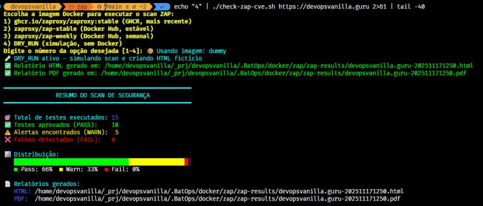

# Scanner de Baseline com OWASP ZAP em Docker - zap-scanner

Esta página documenta a execução containerizada do **zap-scanner**, automação feita em Bash e Docker que executa um scan de baseline (passivo) com o OWASP ZAP em uma URL alvo, gerando um relatório HTML e PDF em `zap-results/`.



## 🛡️ Por que usar esta abordagem?

### Vantagens de Segurança e Isolamento

Esta solução oferece **execução isolada via containers Docker** com suporte completo a ambientes locais e remotos:

- **🔒 Isolamento de segurança**: O ZAP roda em container separado, protegendo o sistema host
- **🌐 Dual-mode networking**: Suporte a URLs públicas (Internet) e locais (Localhost/IPs privados)
- **🏠 Network host mode**: Acesso direto a serviços rodando no host sem configuração complexa
- **🔗 DNS local inteligente**: Detecta automaticamente entradas do `/etc/hosts` e propaga para o container
- **🏝️ Ambiente efêmero**: Container é destruído após cada scan, sem deixar rastros
- **📦 Reprodutibilidade**: Mesma imagem, mesmo ambiente, mesmos resultados
- **🚀 Deploy rápido**: Pronto para uso em segundos, sem configuração manual
- **♻️ Cleanup automático**: Container removido automaticamente com `--rm`
- **🔧 Máxima flexibilidade**: Suporta domínios públicos, privados, localhost e IPs internos

### Casos de uso ideais

- **Scans em ambientes de desenvolvimento/staging**: Aplicações rodando localmente ou em redes privadas
- **URLs em localhost**: Serviços rodando em 127.0.0.1, localhost, ou portas não expostas
- **Pipelines de CI/CD**: GitHub Actions, GitLab CI, Jenkins com integração automática
- **Infraestrutura privada**: Aplicações em VPNs, redes internas, ou IPs não roteáveis
- **Ambientes de produção**: Com aprovação formal e whitelist de IPs
- **Testes de regressão**: Validação contínua de segurança após deploys

## Visão geral

**O que é executado:**

- Validação da URL no formato `http(s)://<fqdn>` (pode conter caminho)
- Seleção automática ou manual da imagem Docker do ZAP (GHCR ou Docker Hub)
- Execução do ZAP Baseline (passivo, sem ataques ativos) dentro de um container Docker
- Geração de relatórios em `zap-results/<fqdn>-<YYYYMMDDHHMM>.html` e `.pdf`

**Requisitos:**

- Docker instalado e em execução
- Permissões para executar Docker (usuário no grupo docker)


## Sobre OWASP ZAP e reputação para essa atividade

O OWASP ZAP (Zed Attack Proxy) é um projeto da OWASP, gratuito e de código aberto, amplamente reconhecido e utilizado para testes de segurança de aplicações web. É um dos scanners mais populares para análise automática, especialmente adequado para pipelines CI/CD e verificações de baseline.

Para esta atividade, usamos o modo Baseline do ZAP:

- Seguro para executar em ambientes de produção (não faz ataques ativos)
- Executa varredura passiva em requisições HTTP(S)
- Ajuda a encontrar problemas comuns de configuração e segurança sem causar interrupções

Observação: um scan passivo não substitui um teste de intrusão completo. Para análises profundas, é recomendado utilizar scans ativos e outras técnicas, em um ambiente controlado.


## O que é testado no Baseline

O ZAP Baseline é focado em detecção passiva. Exemplos de itens verificados:

- Cabeçalhos de segurança ausentes ou mal configurados (ex.: `Content-Security-Policy`, `X-Content-Type-Options`, `X-Frame-Options`, `Strict-Transport-Security`)
- Cookies sem `Secure`/`HttpOnly`/`SameSite`
- Possíveis vazamentos de informação em páginas/headers
- Recursos acessíveis sem HTTPS
- Itens detectáveis sem enviar payloads maliciosos

Por padrão, o baseline realiza um spider leve para descobrir páginas e, então, aplica regras passivas sobre as respostas. Não há exploração ativa.


## 🚀 Como usar

### Modo Recomendado: Script Wrapper Interativo

Execute o script que guia você por todas as opções de configuração:

```bash
./run-zap-scanner.sh
```

**OU** passe a URL como argumento para modo semi-interativo:

```bash
./run-zap-scanner.sh https://finops-hom.sondahybrid.com
```

O script apresentará opções interativas para:

- ✅ Verificar se Docker está instalado e rodando
- 🎯 Validar a URL alvo
- 🌐 **Escolher modo de acesso**: Internet ou Local/Dummy
- 📦 Selecionar imagem ZAP (GHCR ou Docker Hub)
- ⚠️ Alertar sobre scans em produção e solicitar confirmação
- 📝 Solicitar número de ticket/chamado (se produção)
- 🚀 Executar o scan e exibir resultados

### 🌐 Modos de Acesso à URL

#### Internet Access
Para URLs acessíveis via DNS público ou internet:
- Container usa rede bridge padrão do Docker
- Ideal para sites públicos e APIs externas
- Suporta resolução DNS customizada via `--add-host`

```bash
# Exemplo de uso
./run-zap-scanner.sh https://devopsvanilla.guru
# Escolha opção: 1) Internet Access
```

#### Local/Dummy Access 🆕
Para URLs locais, localhost ou serviços internos:
- Container usa `--network host` para acesso direto ao host
- Acessa serviços em 127.0.0.1, localhost ou IPs privados
- Utiliza automaticamente o `/etc/hosts` do host
- **Ideal para**: Aplicações de desenvolvimento, staging, ou serviços não expostos

```bash
# Exemplo de uso
./run-zap-scanner.sh https://app-local.empresa.com
# Escolha opção: 2) Local/Dummy Access

# Ou force o modo via variável de ambiente
NETWORK_MODE=local ./run-zap-scanner.sh http://localhost:8080
```

### Modo Direto: Script check-zap-cve.sh

Para uso avançado, automação ou integração em pipelines:

```bash
# Com seleção interativa de imagem
./check-zap-cve.sh https://seu-site.com

# Com imagem pré-definida
ZAP_IMAGE=zaproxy/zap-stable ./check-zap-cve.sh https://seu-site.com

# Modo simulação (rápido, para testes de integração)
ZAP_IMAGE=DRY_RUN ./check-zap-cve.sh https://seu-site.com

# Forçar modo Local/Dummy Access
NETWORK_MODE=local ZAP_IMAGE=zaproxy/zap-stable ./check-zap-cve.sh http://localhost:3000
```

## ⚙️ Configuração

### Variáveis de Ambiente

| Variável | Descrição | Valores |
|----------|-----------|---------|
| `ZAP_IMAGE` | Define a imagem Docker do ZAP | `ghcr.io/zaproxy/zaproxy:stable`, `zaproxy/zap-stable`, `zaproxy/zap-weekly`, `DRY_RUN` |
| `NETWORK_MODE` | Define o modo de acesso à URL | `internet` (padrão), `local` |
| `SKIP_DEPENDENCY_CHECK` | Pula verificação de dependências | `1` |
| `NO_PROMPT` | Modo não-interativo | `1` |

**Exemplos de uso:**

```bash
# Scan com modo local forçado
NETWORK_MODE=local ./run-zap-scanner.sh http://localhost:8080

# Scan em modo internet com imagem específica
ZAP_IMAGE=zaproxy/zap-stable NETWORK_MODE=internet ./check-zap-cve.sh https://api.exemplo.com

# Modo simulação para testes de CI/CD
ZAP_IMAGE=DRY_RUN NO_PROMPT=1 ./check-zap-cve.sh https://exemplo.com
```

### Opções de execução e imagens ZAP

**Imagens Docker disponíveis:**

1. `ghcr.io/zaproxy/zaproxy:stable` - GitHub Container Registry (mais recente)
2. `zaproxy/zap-stable` - Docker Hub (estável, recomendado)
3. `zaproxy/zap-weekly` - Docker Hub (atualizações semanais)
4. `DRY_RUN` - Modo simulação (sem scan real, apenas para testes)

Em ambientes não-interativos (CI/CD, containers), o script usa automaticamente `ghcr.io/zaproxy/zaproxy:stable`.


## 📊 Resultados

Os relatórios são salvos no diretório `zap-results/` com os seguintes formatos:

- `<dominio>-<timestamp>.html` - Relatório HTML detalhado
- `<dominio>-<timestamp>.pdf` - Relatório PDF (wkhtmltopdf incluído no container)
- `<dominio>-<timestamp>.log` - Log completo da execução

**Visualizar relatórios:**

```bash
# Listar relatórios gerados
ls -la zap-results/

# Abrir relatório HTML (Linux)
xdg-open zap-results/example.com-YYYYMMDDHHMM.html

# Abrir relatório PDF
xdg-open zap-results/example.com-YYYYMMDDHHMM.pdf
```


## 🔧 Troubleshooting

> **📖 Documentação Completa:** Consulte [TROUBLESHOOTING.md](./TROUBLESHOOTING.md) para guia detalhado de resolução de problemas.

### Problemas Comuns

#### ❌ Erro: "Name or service not known"

**Sintoma:**

```text
finops-hom.sondahybrid.com: Name or service not known
```

**Causa:** O domínio não está no DNS público e o container não consegue resolvê-lo.

**Solução 1 - Modo Local/Dummy Access (Recomendado):**

```bash
# Execute o scan e escolha opção 2 (Local/Dummy Access)
./run-zap-scanner.sh https://finops-hom.sondahybrid.com

# Ou force via variável de ambiente
NETWORK_MODE=local ./run-zap-scanner.sh https://finops-hom.sondahybrid.com
```

**Solução 2 - Configurar /etc/hosts + Internet Access:**

```bash
# Adicione o mapeamento DNS no host
echo "192.168.1.100 finops-hom.sondahybrid.com" | sudo tee -a /etc/hosts

# Verifique a resolução
ping -c1 finops-hom.sondahybrid.com

# Execute o scan - o script detectará automaticamente a entrada
./run-zap-scanner.sh https://finops-hom.sondahybrid.com
```

#### ❌ Erro: "Permission denied: '/zap/wrk/zap.yaml'"

**Sintoma:**

```text
Unable to copy yaml file to /zap/wrk/zap.yaml [Errno 13] Permission denied
```

**Causa:** Conflito de permissões entre usuário do container e volume montado.

**Solução:** O script corrige automaticamente as permissões. Se persistir:

```bash
# Correção manual
chmod 777 ./zap-results/
```

#### Permissão negada ao Docker socket

Se você receber erro de permissão:

```bash
sudo chmod 666 /var/run/docker.sock
# ou
sudo usermod -aG docker $USER
newgrp docker
```

#### Erro ao acessar GHCR

**Sintoma:** `OpenSSL SSL_connect: SSL_ERROR_SYSCALL` ou `EOF`

**Causa:** Firewall/proxy corporativo bloqueando `ghcr.io`

**Solução rápida:** Use Docker Hub com `ZAP_IMAGE=zaproxy/zap-stable`

```bash
ZAP_IMAGE=zaproxy/zap-stable ./run-zap-scanner.sh https://seu-site.com
```

**Solução estrutural:** Configure proxy no daemon Docker (`/etc/systemd/system/docker.service.d/proxy.conf`):

```ini
[Service]
Environment="HTTP_PROXY=http://proxy.corp:8080"
Environment="HTTPS_PROXY=http://proxy.corp:8080"
Environment="NO_PROXY=localhost,127.0.0.1,::1,.local,.corp,.internal,registry-1.docker.io,ghcr.io"
```

Em seguida:

```bash
sudo systemctl daemon-reload
sudo systemctl restart docker
docker info | grep -i proxy -A2
```

#### Container não consegue acessar internet

Verifique configurações de rede:

```bash
docker network ls
docker network inspect bridge
```

#### Rate limit no Docker Hub (erro 429)

**Sintoma:** Pulls falham por limite de requisições anônimas

**Solução:** Fazer login no Docker Hub

```bash
docker login
```

#### PDF não é gerado

O wkhtmltopdf está incluído no container e usa `xvfb` para display virtual. Se o PDF não for gerado, verifique os logs do container.

#### Build falha ou imagem não encontrada

Certifique-se de estar no diretório correto:

```bash
cd /caminho/para/.BatOps/docker/zap
docker build -t zap-scanner .
```

## 📝 Notas técnicas

- **Network modes**: Suporta bridge (padrão) e host (para acesso local)
- **DNS resolution**: Detecção automática de `/etc/hosts` com propagação via `--add-host`
- **Container lifecycle**: Ambiente efêmero destruído após execução com `--rm`
- **Security scanning**: Modo Baseline (passivo) seguro para ambientes de produção
- **Reporting**: Geração automática de HTML e PDF com wkhtmltopdf
- **CI/CD ready**: Suporte completo a pipelines com modo `DRY_RUN` para testes
- **Multi-environment**: Funciona em desenvolvimento, staging e produção com aprovação


## 🔒 Segurança

Este container executa em modo privilegiado e tem acesso ao socket do Docker. Use apenas em ambientes de desenvolvimento/teste confiáveis.

### ⚠️ AVISO IMPORTANTE: Scans em Ambientes de Produção

**Executar scans de segurança em ambientes de produção pode gerar alertas críticos de intrusão!**

Ambientes produtivos, especialmente aqueles hospedados em **nuvens públicas** (AWS, Azure, GCP) e com **CDN** (CloudFlare, Akamai, Fastly), normalmente possuem:

- 🚨 **WAF (Web Application Firewall)** - Detecta e bloqueia padrões de ataque
- 🔍 **IDS/IPS (Intrusion Detection/Prevention Systems)** - Identifica comportamentos suspeitos
- 📊 **SIEM (Security Information and Event Management)** - Correlaciona eventos de segurança
- 🛡️ **DDoS Protection** - Pode interpretar o scan como ataque distribuído
- 📧 **Alertas automáticos** - Equipes de segurança e NOC serão notificados

#### Consequências de scans não autorizados

- ⛔ **Bloqueio de IP** temporário ou permanente
- 🚫 **Rate limiting** aplicado pela CDN
- 📞 **Escalação para times de segurança** e resposta a incidentes
- 📋 **Abertura de tickets** de investigação de incidentes
- ⚖️ **Possíveis implicações legais** em ambientes corporativos

#### ✅ Boas práticas para scans em produção

1. **Obtenha autorização formal** dos times de Segurança da Informação e Monitoramento
2. **Agende uma janela de teste** com antecedência
3. **Solicite whitelist do IP** de origem nos sistemas de segurança
4. **Informe o NOC/SOC** sobre o horário e escopo do teste
5. **Documente** o teste com número de chamado/ticket
6. **Use ambientes de staging/homologação** quando possível
7. **Configure alertas** como "esperados" no SIEM durante o período do teste

#### Recomendação

Para scans de rotina, sempre prefira executar em:

- 🧪 Ambientes de **desenvolvimento/staging**
- 🏠 Infraestrutura **on-premises** controlada
- 🔒 Ambientes **isolados** sem CDN/WAF ativo
- 📝 Com **aprovação documentada** quando absolutamente necessário em produção

## Agradecimentos

Este projeto utiliza as seguintes ferramentas e dependências:

- **[OWASP ZAP (Zed Attack Proxy)](https://www.zaproxy.org/)** - Scanner de segurança de aplicações web, open source e mantido pela OWASP
  - Imagens Docker: `ghcr.io/zaproxy/zaproxy:stable`, `zaproxy/zap-stable`, `zaproxy/zap-weekly`
  - Licença: Apache License 2.0

- **[Docker](https://www.docker.com/)** - Plataforma de containerização utilizada para executar o ZAP de forma isolada e portável
  - Licença: Apache License 2.0

- **[wkhtmltopdf](https://wkhtmltopdf.org/)** - Ferramenta de conversão de HTML para PDF usando o engine de renderização Qt WebKit
  - Licença: LGPLv3

Agradecemos também à comunidade OWASP e aos mantenedores de todas essas ferramentas pelo trabalho contínuo em tornar a segurança de aplicações mais acessível.

---

Este script faz parte do **[.BatOps](https://github.com/devopsvanilla/.BatOps)** - Uma coleção de scripts utilitários para DevOps e automação.
