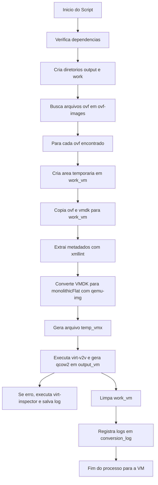

# 🛠️ Conversor de imagens do VMware (ovf) para KVM (qcow2)

Este conjunto de ferramentas foi desenvolvido para automatizar e validar a migração de máquinas virtuais de ambientes **VMware (ESXi/vSphere)** para **KVM/Proxmox**, com suporte específico para execução em **Ubuntu** (Nativo ou WSL2).

O diferencial desta ferramenta é a injeção automática de drivers **VirtIO** e a reconstrução de metadados, garantindo que o Windows ou Linux de origem inicie corretamente no ambiente KVM.

---

## 📋 1. Requisitos de Execução

### Sistema Operacional Recomendado
* **Ubuntu 22.04 LTS ou 24.04 LTS** (Nativo ou em instância isolada).
* **WSL2 (Windows Subsystem for Linux)**: Requer que a Virtualização Aninhada (Nested Virtualization) esteja ativa na BIOS/UEFI e no Windows.

### Dependências Técnicas
O script `setup-tools.sh` instalará automaticamente:
* `virt-v2v`: Motor de conversão e injeção de drivers.
* `rhsrvany`: Binários Windows essenciais para o primeiro boot de guests Windows.
* `libguestfs-winsupport`: Suporte a NTFS (ACLs e atributos) em ferramentas guestfs.
* `nbdkit`: Ferramenta para exportação de discos via rede/local (melhora estabilidade).
* `libguestfs-tools`: Manipulação de sistemas de arquivos internos da VM.
* `qemu-utils`: Conversão de formatos de disco rígido virtual.
* `libxml2-utils`: Extração de metadados de arquivos XML/OVF.

Para uma lista completa de componentes de terceiros e suas licenças, consulte o arquivo [THIRDPARTY.md](./THIRDPARTY.md).

---

## 📂 2. Estrutura de Diretórios

O projeto utiliza a seguinte organização de pastas:

```text
.
├── setup-tools.sh          # [SCRIPT] Instalador de infraestrutura e dependências
├── validate-ovf.sh         # [SCRIPT] Diagnóstico detalhado de integridade (Detetive)
├── convert-ovf-qcow2.sh    # [SCRIPT] Processador de conversão e injeção VirtIO
├── README.md               # [DOC] Este guia de utilização
├── ovf-images/             # [ENTRADA] Coloque aqui suas pastas de OVF/VMDK originais
├── output/                 # [SAÍDA] Onde os arquivos .qcow2 finais serão gerados
├── work/                   # [TEMP] Espaço temporário para processamento de discos
└── conversion.log          # [LOG] Registro histórico de todas as conversões
```

---

## 💿 3. Requisitos das Imagens de Origem

Para evitar o erro de "No root device found", certifique-se de que:
1.  **VM Desligada**: A origem deve ter sido exportada com a VM em estado **Power Off**.
2.  **Arquivos Completos**:
    * **Formato StreamOptimized**: Um único arquivo `.vmdk` grande (GBs).
    * **Formato Monolithic Flat**: Um arquivo `.vmdk` pequeno (Descriptor) e um arquivo **`-flat.vmdk`** grande (Dados).
3.  **Localização**: Cada VM deve estar em sua própria subpasta dentro de `./ovf-images/`.

---

## 🚀 4. Guia de Execução (Sequência Obrigatória)

### Passo 1: Preparação do Sistema
Instale as ferramentas necessárias e configure as permissões de hardware.
```bash
sudo chmod +x *.sh
sudo ./setup-tools.sh
# Importante: Aplique os grupos de hardware sem reiniciar
newgrp kvm && newgrp libvirt
```

### Passo 2: Validação (O "Detetive")
Execute o validador para garantir que os arquivos não estão corrompidos ou incompletos.
```bash
./validate-ovf.sh
```

### Passo 3: Conversão Real
Se a validação retornar **OK**, inicie a conversão.
Se a validação retornar **OK**, inicie a conversão. Para imagens com Windows EOL, utilize a flag de força.
```bash
# Conversão padrão
./convert-ovf-qcow2.sh

# Conversão permitindo Windows End of Life (EOL)
./convert-ovf-qcow2.sh --force-wineol
```

---


## 🗺️ 5. Fluxo Operacional do Script `convert-ovf-qcow2.sh`



### Sequência operacional detalhada

1. **Verificação de Dependências**
    O script checa se os programas `xmllint`, `qemu-img`, `virt-v2v` e `virt-inspector` estão instalados. Se faltar algum, aborta com erro.

2. **Preparação de Diretórios**
    Garante a existência dos diretórios de saída (`./output`), trabalho temporário (`./work`) e log (`conversion.log`).

3. **Busca de Arquivos OVF**
    Procura recursivamente por arquivos `.ovf` dentro de `./ovf-images`.

4. **Processamento de Cada VM**
    Para cada arquivo `.ovf` encontrado:
    - Cria uma subpasta temporária em `./work/<vm>`.
    - Copia o `.ovf` e todos os `.vmdk` da pasta de origem para a área de trabalho temporária.

5. **Extração de Metadados**
    Utiliza `xmllint` para extrair informações de RAM, CPU e firmware do arquivo OVF.

6. **Normalização dos Discos**
    Converte cada VMDK para o formato monolithicFlat usando `qemu-img`, facilitando o processamento posterior.

7. **Geração do Descritor VMX**
    Cria um arquivo `temp.vmx` com as configurações de hardware e discos, servindo de ponte para o `virt-v2v`.

8. **Conversão e Injeção de Drivers**
    Executa `virt-v2v` para converter a VM para QCOW2, injetando drivers VirtIO e salvando o resultado em `./output/<vm>`.

9. **Diagnóstico de Erros**
    Se a conversão falhar, executa `virt-inspector` para diagnóstico e salva logs detalhados.

10. **Limpeza de Temporários**
     Remove a pasta de trabalho temporária da VM em `./work/<vm>`.

11. **Registro de Logs**
     Todas as etapas e erros são registrados em `conversion.log`.

12. **Finalização**
     Ao processar todas as VMs, exibe mensagem de conclusão.

---

## 📊 6. Interpretando o Relatório de Validação

| Status | Significado | Ação Necessária |
| :--- | :--- | :--- |
| **OK (READY)** | Arquivo completo e pronto. | Seguir para a conversão. |
| **DUMMY_HEADER** | O VMDK tem apenas KBs; faltam os dados. | Exportar novamente do vSphere. |
| **MISSING -FLAT** | Identificado arquivo Descriptor, mas o binário de dados sumiu. | Localizar o arquivo `-flat.vmdk` na origem. |
| **CORRUPT_FILE** | O cabeçalho do disco está ilegível. | Verificar integridade do download/cópia. |

---

## 🛡️ 6. Segurança e Isolamento

> [!IMPORTANT]
> **ESTE SCRIPT NÃO DEVE SER EXECUTADO NO HOST DO KVM/PROXMOX.**
> Por razões de segurança e estabilidade, a execução deve ocorrer em uma máquina **Ubuntu** isolada ou ambiente **WSL2**.
> O `virt-v2v` monta sistemas de arquivos temporários e instala drivers que podem conflitar com kernels de hipervisores em produção. Converta em ambiente de *staging* e mova apenas o `.qcow2` final para o host de produção.

---

## ⚠️ 7. Problemas Comuns

* **"No root device found"**: Quase sempre significa que o arquivo `.vmdk` não contém os dados reais do Windows (falta o `-flat` ou exportação corrompida).
* **Permission Denied em /dev/kvm**: Seu usuário não tem permissão de hardware. Certifique-se de ter rodado `setup-tools.sh` e o comando `newgrp`.
* **Erro de Socket Libvirt**: Os scripts usam o `LIBGUESTFS_BACKEND=direct` para evitar a necessidade de um serviço Libvirt rodando, mas isso requer suporte a KVM no kernel.

---

## ⚖️ 8. Nota de Isenção (Disclaimer)

**AVISO:** Estes scripts são fornecidos "como estão", sem garantias de qualquer tipo, expressas ou implícitas. A conversão de sistemas operacionais é um processo crítico que envolve riscos de perda de dados ou corrupção de boot. É de inteira responsabilidade do usuário garantir a existência de **backups verificados** antes de qualquer operação. O autor não se responsabiliza por danos resultantes do uso desta ferramenta.

---
---

## 🛡️ 9. Ressalvas Técnicas: Sistemas Legados e Sem Suporte

O uso de `--force-wineol` permite o processamento das seguintes versões detectadas como fora de suporte:

| Versão | Tipo | Fim do Suporte | Fonte Oficial |
| :--- | :--- | :--- | :--- |
| **Windows XP** | Desktop | 2014-04-08 | [Ciclo de Vida Microsoft](https://learn.microsoft.com/pt-br/lifecycle/products/windows-xp) |
| **Windows 7** | Desktop | 2020-01-14 | [Ciclo de Vida Microsoft](https://learn.microsoft.com/pt-br/lifecycle/products/windows-7) |
| **Windows 8.1** | Desktop | 2023-01-10 | [Ciclo de Vida Microsoft](https://learn.microsoft.com/pt-br/lifecycle/products/windows-8-1) |
| **Windows Server 2012 / R2** | Server | 2023-10-10 | [Ciclo de Vida Microsoft](https://learn.microsoft.com/pt-br/lifecycle/products/windows-server-2012-r2) |
| **Windows 10 (1809 a 21H2)** | Desktop | 2021-2024 | [Ciclo de Vida Microsoft](https://learn.microsoft.com/pt-br/lifecycle/products/windows-10-home-and-pro) |
| **Windows 10 22H2 / LTSB 2015** | Desktop | 2025-10-14 | [Ciclo de Vida Microsoft](https://learn.microsoft.com/pt-br/lifecycle/products/windows-10-enterprise-2015-ltsb) |

### Inconsistências e Instabilidade
*   **Drivers VirtIO**: O suporte para VirtIO em sistemas legados é mantido de forma comunitária ou legado. A falta de drivers compatíveis com o kernel do guest pode causar **BSOD (Blue Screen of Death)** imediatos após a migração ou instabilidades rítmicas de I/O.
*   **Performance**: Sistemas sem suporte podem não aproveitar as otimizações modernas de virtualização, resultando em latência elevada de disco e rede no KVM.

### Vulnerabilidades de Segurança
*   **Exploits**: Sistemas EOL não recebem patches de segurança. Migrar essas VMs para novos ambientes pode expor falhas conhecidas (ex: SMBv1 no XP) que são facilmente exploradas se houver conectividade de rede.
*   **Injeção de Scripts**: O uso de `rhsrvany.exe` para automação de primeiro boot envolve a execução de binários em modo privilegiado no Windows. Em sistemas inseguros, esse mecanismo pode ser um vetor de comprometimento caso a imagem original já esteja infectada.

### Recomendações
*   Mantenha estas VMs isoladas em **VLANs restritas**.
*   Sempre valide a existência de drivers adequados em `/usr/share/virtio-win/` antes da conversão.
*   Considere a **modernização** da aplicação em vez da migração da infraestrutura sempre que possível.

---
**BatOps** - *Automation & Infrastructure Engineering*
