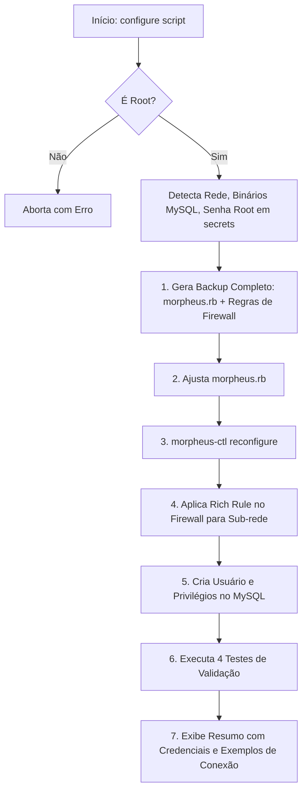
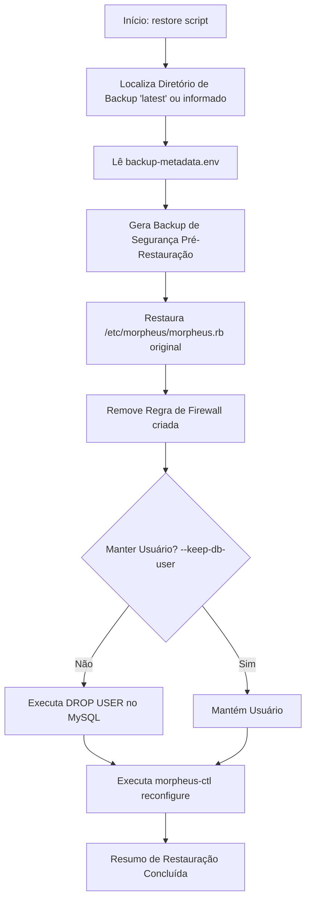

# Acesso Remoto ao MySQL Embarcado do HPE Morpheus Data Enterprise

Este diretório scripts de automação em Shell Script desenvolvida para permitir de forma segura, rastreável e controlada o acesso de rede ao banco de dados MySQL/Percona Galera embarcado em appliances **HPE Morpheus Data Enterprise** (compatível com arquiteturas *Single-Node* e clusters de alta disponibilidade *3-Node HA*).

---

## 📋 Sumário

- [Visão Geral](#-visão-geral)
- [Arquivos do Pacote](#-arquivos-do-pacote)
- [Pré-requisitos](#-pré-requisitos)
- [Fluxo de Funcionamento](#-fluxo-de-funcionamento)
- [Script de Configuração (`configure-...sh`)](#-script-de-configuração-configure-morpheus-mysql-remote-accesssh)
  - [Opções e Parâmetros](#opções-e-parâmetros)
  - [Exemplos de Uso](#exemplos-de-uso)
  - [Testes Automatizados de Validação](#testes-automatizados-de-validação)
- [Matriz de Permissões: root vs Usuário Criado](#-matriz-de-permissões-root-vs-usuário-criado)
- [Script de Restauração (`restore-...sh`)](#-script-de-restauração-restore-morpheus-mysql-remote-accesssh)
  - [Opções e Parâmetros](#opções-e-parâmetros-1)
  - [Exemplos de Restauração](#exemplos-de-restauração)
- [Estrutura de Backups e Metadados](#-estrutura-de-backups-e-metadados)
- [Comportamento em Cluster 3-Node HA (Galera)](#-comportamento-em-cluster-3-node-ha-galera)
- [Como Conectar ao Banco Remotamente](#-como-conectar-ao-banco-remotamente)
- [Boas Práticas de Segurança e Dicas](#-boas-práticas-de-segurança-e-dicas)

---

## 🎯 Visão Geral

Por padrão, a instalação do HPE Morpheus Data Enterprise restringe o acesso ao banco de dados MySQL/Percona em execução no nó para conexões locais (socket/localhost) e para tráfego interno de replicação entre nós do cluster.

Estes scripts automatizam com alta confiabilidade e tolerância a falhas:
1. **Snapshot de Backup Automático** de todas as configurações existentes (`morpheus.rb` e regras de firewall) antes de qualquer alteração.
2. **Ajuste de Escuta de Rede** nas diretivas do appliance Morpheus.
3. **Liberação Granular de Firewall** apenas para o IP ou sub-rede CIDR desejada (compatível com `firewalld`, `ufw` e `iptables`).
4. **Criação de Usuário Dedicado no MySQL** com senha forte gerada aleatoriamente (ou informada via CLI) e privilégios granulares (completo ou *somente leitura*).
5. **Bateria de Testes Automatizados** que valida o status do serviço, a escuta da porta `3306/tcp`, a autenticação TCP e a integridade das tabelas do catálogo.
6. **Rollback Seguro e Descomplicado** via script de restauração que desfaz todas as alterações e ainda gera um backup de segurança pré-restauração (*safety backup*).

---

## 📂 Arquivos do Pacote

| Arquivo | Descrição |
| :--- | :--- |
| `configure-morpheus-mysql-remote-access.sh` | Script principal para habilitar o acesso remoto, gerar backup, configurar firewall, criar usuário no MySQL e rodar testes de validação em 4 etapas. |
| `restore-morpheus-mysql-remote-access.sh` | Script de reversão completa que desfaz as alterações, restaura configurações, remove regras de firewall e exclui o usuário criado. |
| `README.md` | Documentação técnica detalhada, parâmetros, topologias e exemplos práticos de conexão. |

---

## ⚙️ Pré-requisitos

- Execução com privilégios de **superusuário (`root` / `sudo`)**.
- Appliance HPE Morpheus Data Enterprise operacional.
- Binários utilitários comuns do Linux: `bash` (v4+), `openssl`, `ss` ou `netstat`, `ip` ou `hostname`.
- Um dos gerenciadores de firewall: `firewalld` (RHEL/Alma/Rocky/CentOS), `ufw` (Ubuntu) ou `iptables`.

---

## 🔄 Fluxo de Funcionamento



---

## 🚀 Script de Configuração (`configure-morpheus-mysql-remote-access.sh`)

### Opções e Parâmetros

| Parâmetro | Parâmetro Longo | Descrição | Padrão |
| :--- | :--- | :--- | :--- |
| `-s` | `--subnet <CIDR\|IP>` | Sub-rede ou IP de origem autorizado (ex: `192.168.1.0/24`, `10.0.0.50`, `%`). | Auto-detecta rede local |
| `-u` | `--db-user <USUÁRIO>` | Nome do usuário MySQL a ser criado/atualizado. | `morpheus_remote` |
| `-p` | `--db-password <SENHA>` | Senha do usuário MySQL. Se omitida, gera uma senha segura randômica. | *(Gerada aleatoriamente)* |
| `-d` | `--db-name <BANCO>` | Nome da base de dados Morpheus a ser concedida. | `morpheus` |
| | `--read-only` | Concede somente permissões de leitura (`SELECT`, `SHOW VIEW`). | `false` (ALL PRIVILEGES) |
| | `--skip-reconfigure` | Não executa `morpheus-ctl reconfigure` (útil para dry-run ou testes). | `false` |
| `-b` | `--backup-dir <DIR>` | Diretório base para armazenar os backups gerados. | `/var/opt/morpheus/backups/mysql-remote-access` |
| `-c` | `--config <ARQUIVO>` | Caminho do arquivo de configuração do Morpheus. | `/etc/morpheus/morpheus.rb` |
| `-h` | `--help` | Exibe a tela de ajuda com os parâmetros e encerra. | - |

---

### Exemplos de Uso

#### 1. Modo Interativo / Automático
Detecta a sub-rede local pela interface de rede primária e gera uma senha forte de 16 caracteres com alta entropia:
```bash
sudo ./configure-morpheus-mysql-remote-access.sh
```

#### 2. Definindo uma Sub-rede e Usuário Específicos
```bash
sudo ./configure-morpheus-mysql-remote-access.sh \
  --subnet 192.168.1.0/24 \
  --db-user relatorios_bi
```

> [!IMPORTANT]
> **O que acontece com o usuário MySQL neste exemplo:**
> - **Criação Efetiva no MySQL**: O script conecta no banco local como administrador e executa `CREATE USER IF NOT EXISTS 'relatorios_bi'@'192.168.1.%'` (e `ALTER USER` caso já exista).
> - **Padrão de Host Restrito**: A sub-rede CIDR `192.168.1.0/24` é convertida para `'192.168.1.%'`, garantindo que apenas máquinas dessa faixa consigam autenticar com esse usuário.
> - **Geração Automática de Senha**: Como `-p` não foi informado, uma senha segura e randômica de 16 caracteres é gerada automaticamente e exibida no painel final do terminal para você copiar.
> - **Concessão de Privilégios**: É aplicado `GRANT ALL PRIVILEGES ON \`morpheus\`.* TO 'relatorios_bi'@'192.168.1.%'`.
> - **Replicação Galera (3-Node HA)**: Por ser um cluster Galera, o usuário e seus privilégios são **automaticamente replicados para os nós 2 e 3**.
>
> *Caso deseje que esse usuário tenha apenas permissão de consulta (ideal para BI/Dashboards), adicione a flag `--read-only`.*

#### 3. Acesso Somente Leitura (*Read-Only*) para Análise ou BI
Ideal para conectar ferramentas de BI (PowerBI, Metabase, Tableau, Superset) sem risco de alteração acidental de dados. O usuário receberá apenas privilégios de leitura (`SELECT, SHOW VIEW`):
```bash
sudo ./configure-morpheus-mysql-remote-access.sh \
  --subnet 10.20.0.0/16 \
  --db-user bi_reader \
  --db-password 'Morpheus#Bi2026!Sec' \
  --read-only
```

#### 4. Liberando Apenas um Único Host (IP Fixo)
O script converte o IP para notação exata (`192.168.1.150` sem wildcard `%`), liberando o firewall e o MySQL apenas para essa estação de trabalho:
```bash
sudo ./configure-morpheus-mysql-remote-access.sh \
  --subnet 192.168.1.150/32 \
  --db-user dev_dba
```

---

### Testes Automatizados de Validação

Ao final da execução, o script executa 4 testes automatizados para garantir que a liberação está totalmente funcional:

1. **Teste 1/4 - Serviço Ativo**: Verifica via `morpheus-ctl status mysql` e processos do SO se o daemon `mysqld` está em execução.
2. **Teste 2/4 - Escuta de Porta**: Valida via `ss` ou `netstat` se a porta `3306/tcp` está ouvindo conexões de rede.
3. **Teste 3/4 - Autenticação TCP de Rede**: Realiza uma tentativa de login real via cliente MySQL conectando na interface TCP (`<IP>:3306`) com o usuário e a senha gerados.
4. **Teste 4/4 - Integridade do Esquema**: Executa uma query no catálogo (`information_schema.tables`) confirmando o acesso às tabelas da base `morpheus`.

---

## 🔐 Matriz de Permissões: `root` vs Usuário Criado

O usuário remoto criado pelo script possui **acesso total aos dados do catálogo do Morpheus**, mas **não recebe privilégios administrativos globais do servidor MySQL**, preservando a integridade e segurança do appliance:

| Capacidade / Privilégio | `root` (Local) | Usuário Remoto Criado (`--db-user`) | Observações |
| :--- | :---: | :---: | :--- |
| **Consultar dados no banco `morpheus`** (`SELECT`) | Sim | **SIM (Concedido)** | Leitura completa de tabelas e views do Morpheus |
| **Inserir / Alterar / Apagar dados** (`INSERT, UPDATE, DELETE`) | Sim | **SIM (Concedido)** | *Bloqueado se utilizada a flag `--read-only`* |
| **Criar / Alterar / Excluir tabelas** (`CREATE, ALTER, DROP`) | Sim | **SIM (Concedido)** | *Bloqueado se utilizada a flag `--read-only`* |
| **Acessar bases de sistema** (`mysql`, `sys`, `performance_schema`) | Sim | ❌ **NÃO (Bloqueado)** | Restrito exclusivamente ao banco `morpheus`.* |
| **Criar ou excluir outros usuários** (`CREATE USER, DROP USER`) | Sim | ❌ **NÃO (Bloqueado)** | Criado sem cláusula `WITH GRANT OPTION` |
| **Alterar variáveis globais do MySQL** (`SET GLOBAL`) | Sim | ❌ **NÃO (Bloqueado)** | Sem privilégio `SUPER` / `SYSTEM_VARIABLES_ADMIN` |
| **Gerenciar o Cluster Galera** (nós, descarte de réplicas) | Sim | ❌ **NÃO (Bloqueado)** | Impede desestabilização da topologia HA |
| **Desligar o daemon MySQL** (`SHUTDOWN`) | Sim | ❌ **NÃO (Bloqueado)** | Sem permissão de shutdown |
| **Ver processos de outros usuários** (`PROCESSLIST`) | Sim | ❌ **NÃO (Bloqueado)** | Enxerga unicamente suas próprias consultas ativas |

---

## ⏪ Script de Restauração (`restore-morpheus-mysql-remote-access.sh`)

Permite desfazer integralmente as alterações e retornar o appliance ao estado de isolamento original.



### Opções e Parâmetros

| Parâmetro | Parâmetro Longo | Descrição | Padrão |
| :--- | :--- | :--- | :--- |
| `-b` | `--backup-dir <DIR>` | Caminho do backup específico a ser restaurado. Se omitido, utiliza o link `latest`. | `/var/opt/morpheus/backups/mysql-remote-access/latest` |
| | `--keep-db-user` | Mantém o usuário MySQL no banco (não executa `DROP USER`). | `false` (remove o usuário) |
| | `--skip-reconfigure` | Não executa `morpheus-ctl reconfigure` após a restauração. | `false` |
| `-c` | `--config <ARQUIVO>` | Caminho do arquivo de configuração do Morpheus. | `/etc/morpheus/morpheus.rb` |
| `-h` | `--help` | Exibe a tela de ajuda da restauração. | - |

---

### Exemplos de Restauração

#### 1. Reversão Padrão Automática
Restaura o último backup gerado (utilizando o symlink `latest`):
```bash
sudo ./restore-morpheus-mysql-remote-access.sh
```

#### 2. Restaurar a Partir de um Snapshot Específico
```bash
sudo ./restore-morpheus-mysql-remote-access.sh \
  --backup-dir /var/opt/morpheus/backups/mysql-remote-access/backup-20260910_041500
```

#### 3. Reverter Firewall e Configurações, mas Preservar o Usuário do Banco
```bash
sudo ./restore-morpheus-mysql-remote-access.sh --keep-db-user
```

---

## 💾 Estrutura de Backups e Metadados

Os backups são centralizados por padrão em `/var/opt/morpheus/backups/mysql-remote-access/`:

```text
/var/opt/morpheus/backups/mysql-remote-access/
├── latest -> /var/opt/morpheus/backups/mysql-remote-access/backup-20260910_041500
├── backup-20260910_041500/
│   ├── morpheus.rb.bak            # Cópia idêntica do morpheus.rb antes da alteração
│   ├── firewalld-state.txt        # Snapshot das zonas e rich rules do firewall
│   └── backup-metadata.env        # Metadados com sub-rede, usuário, backend e flags
└── pre-restore-20260910_043500/   # Backup de segurança gerado ANTES de restaurar
    ├── morpheus.rb.current.bak
    └── firewalld-pre-restore.txt
```

### Arquivo `backup-metadata.env`
Armazena as variáveis usadas no provisionamento para que a restauração seja 100% autônoma, sem necessidade de reinserir dados:
```bash
BACKUP_TIMESTAMP="20260910_041500"
MORPHEUS_CONFIG="/etc/morpheus/morpheus.rb"
DB_NAME="morpheus"
DB_USER="morpheus_remote"
SUBNET="192.168.1.0/24"
MYSQL_HOST_PATTERN="192.168.1.%"
FIREWALL_BACKEND="firewalld"
READ_ONLY="false"
```

---

## 🏛️ Comportamento em Cluster 3-Node HA (Galera)

Se o seu ambiente for uma topologia **3-Node High Availability (HA)** do Morpheus:

1. **Replicação Automática de Usuários**:
   O MySQL do appliance opera via **Galera Cluster**. Portanto, comandos DDL/DCL como `CREATE USER`, `GRANT` ou `DROP USER` executados em um dos nós são **automaticamente replicados** para os outros 2 nós do cluster.
2. **Configuração de Host e Firewall Individual**:
   As regras de firewall do sistema operacional (`firewalld`/`ufw`/`iptables`) e o arquivo `/etc/morpheus/morpheus.rb` pertencem à máquina local de cada nó.
   - Caso deseje que as máquinas clientes consigam conectar diretamente no IP de **qualquer um dos 3 nós**, execute o script de configuração em cada um dos nós com a mesma `--subnet` e `--db-user`.
   - Se os nós estiverem atrás de um Balanceador de Carga de banco de dados (ex: HAProxy interno do Morpheus ou VIP externo), certifique-se de liberar a porta no balanceador e aponte o cliente para o IP do VIP.

---

## 🔌 Como Conectar ao Banco Remotamente

Após a execução bem-sucedida do script `configure-...sh`, os dados de conexão e exemplos prontos são exibidos no terminal.

### 1. Teste de Conectividade de Rede (Porta 3306)

- **Linux / macOS**:
  ```bash
  nc -zv <IP_DO_APPLIANCE> 3306
  ```
- **Windows PowerShell**:
  ```powershell
  Test-NetConnection -ComputerName <IP_DO_APPLIANCE> -Port 3306
  ```

### 2. Conexão via Cliente MySQL CLI
```bash
mysql -h <IP_DO_APPLIANCE> -P 3306 -u morpheus_remote -p morpheus
```

### 3. Conexão via Ferramentas Gráficas (DBeaver, DataGrip, HeidiSQL, MySQL Workbench)
- **Driver**: MySQL ou MariaDB
- **Host**: `<IP_DO_APPLIANCE>`
- **Porta**: `3306`
- **Database**: `morpheus`
- **Usuário**: `morpheus_remote` (ou o usuário definido em `-u`)
- **Senha**: *(senha gerada ou fornecida no script)*
- **SSL**: Habilitar caso tenha certificados configurados, ou definir `useSSL=false` / `allowPublicKeyRetrieval=true` para redes internas isoladas.

### 4. String de Conexão JDBC
```text
jdbc:mysql://<IP_DO_APPLIANCE>:3306/morpheus?useSSL=false&allowPublicKeyRetrieval=true&serverTimezone=UTC
```

---

## 🔒 Boas Práticas de Segurança

- **Evite curingas globais (`%`) em produção**: Sempre que possível, restrinja o parâmetro `--subnet` a um IP único (`192.168.1.50/32`) ou à sub-rede estrita de gerência (`10.x.x.0/24`).
- **Use `--read-only` para relatórios e consultas**: Se o objetivo do acesso for auditoria, monitoramento ou dashboards (Grafana, PowerBI, Metabase), use sempre `--read-only` para garantir que nenhuma operação de `UPDATE`, `DELETE` ou `DROP` seja executada contra o banco do Morpheus.
- **Restauração Rápida**: Ao término de manutenções ou extrações pontuais, execute `sudo ./restore-morpheus-mysql-remote-access.sh` para fechar a porta no firewall e eliminar credenciais remotas.
