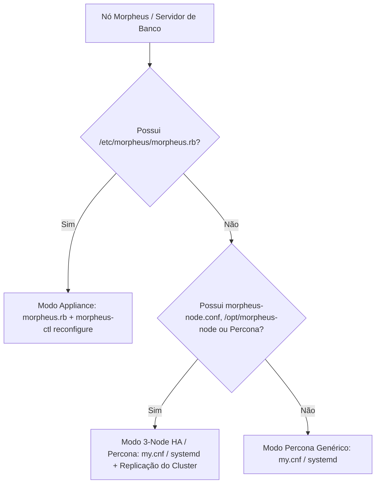
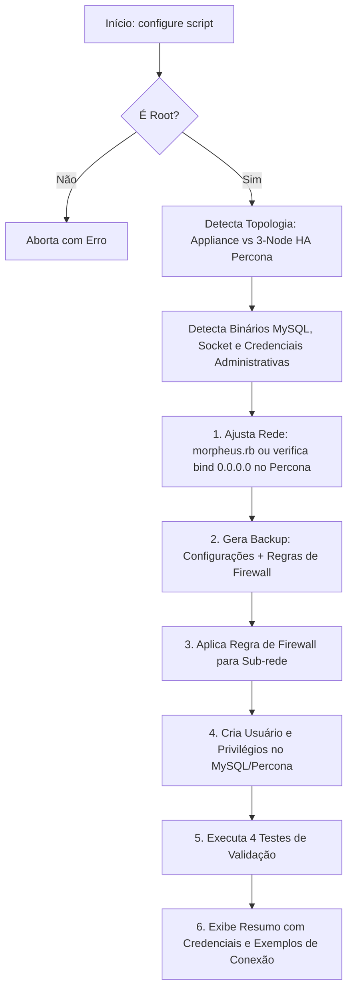
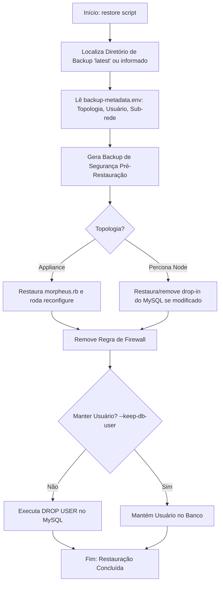

# Acesso Remoto ao MySQL/Percona do HPE Morpheus Data Enterprise

Automação em Shell Script desenvolvida para permitir de forma segura, rastreável e controlada o acesso de rede ao banco de dados MySQL/Percona em cluster embarcado em appliances **HPE Morpheus Data Enterprise**.

Compatível nativamente com arquiteturas **Single-Node (Omnibus / `morpheus.rb`)** e **Three-Node HA (Percona XtraDB Cluster / `morpheus-node`)**.

---

## 📋 Sumário

- [Visão Geral](#-visão-geral)
- [Arquivos do Pacote](#-arquivos-do-pacote)
- [Pré-requisitos](#-pré-requisitos)
- [Topologias Suportadas](#-topologias-suportadas)
- [Fluxo de Funcionamento](#-fluxo-de-funcionamento)
- [Script de Configuração (`configure-...sh`)](#-script-de-configuração-configure-morpheus-mysql-remote-accesssh)
  - [Opções e Parâmetros](#opções-e-parâmetros)
  - [Exemplos de Uso](#exemplos-de-uso)
  - [Testes Automatizados de Validação](#testes-automatizados-de-validação)
- [Matriz de Permissões: root vs Usuário Criado](#-matriz-de-permissões-root-vs-usuário-criado)
- [Script de Restauração (`restore-...sh`)](#-script-de-restauração-restore-morpheus-mysql-remote-accesssh)
  - [Opções e Parâmetros](#opções-e-parâmetros-1)
  - [Exemplos de Restauração](#exemplos-de-restauração)
- [Estrutura de Backups e Metadados](#-estrutura-de-backups-e-metadados)
- [Comportamento em Cluster 3-Node HA (Percona Cluster)](#-comportamento-em-cluster-3-node-ha-percona-cluster)
- [Como Conectar ao Banco Remotamente](#-como-conectar-ao-banco-remotamente)
- [Boas Práticas de Segurança e Dicas](#-boas-práticas-de-segurança-e-dicas)

---

## 🎯 Visão Geral

Por padrão, as instalações do HPE Morpheus Data Enterprise restringem o tráfego do banco de dados MySQL/Percona aos limites locais do host (`localhost` / Unix socket) ou exclusivamente para comunicação interna entre nós do cluster.

Estes scripts automatizam com alta confiabilidade e tolerância a falhas:

1. **Detecção Automática de Topologia**: Identifica se o ambiente é Single-Node (Appliance com `morpheus.rb`) ou Three-Node HA (com Percona XtraDB Cluster / `morpheus-node`).
2. **Snapshot de Backup Automático**: Salva o estado do firewall e cópia das configurações antes de qualquer modificação.
3. **Ajuste de Escuta de Rede**: Garante que o MySQL escute em `0.0.0.0:3306`, evitando reinicializações desnecessárias caso a porta já esteja em modo de escuta de rede.
4. **Liberação Granular de Firewall**: Libera a porta 3306 apenas para a sub-rede ou IP de origem desejado (`firewalld`, `ufw` ou `iptables`).
5. **Criação de Usuário Dedicado no MySQL**: Concede privilégios restritos à base `morpheus.*` (completo ou *somente leitura*), replicando automaticamente entre os nós do cluster Percona.
6. **Bateria de Testes Automatizados**: Valida processo ativo, escuta de porta, autenticação TCP e catálogo de tabelas.
7. **Rollback Seguro**: Restaura configurações anteriores, remove regras de firewall e desfaz o usuário criado.

---

## 📂 Arquivos do Pacote

| Arquivo | Descrição |
| :--- | :--- |
| `configure-morpheus-mysql-remote-access.sh` | Script principal para habilitar o acesso remoto, gerar backup, configurar firewall, criar usuário no MySQL/Percona e rodar testes de validação em 4 etapas. |
| `restore-morpheus-mysql-remote-access.sh` | Script de reversão completa que desfaz as alterações, restaura configurações originais, remove regras de firewall e exclui o usuário criado. |
| `README.md` | Documentação técnica detalhada, parâmetros, topologias e exemplos práticos de conexão. |

---

## ⚙️ Pré-requisitos

- Execução com privilégios de **superusuário (`root` / `sudo`)**.
- Appliance HPE Morpheus Data Enterprise ou nó de banco operacional.
- Utilitários comuns do Linux: `bash` (v4+), `openssl`, `ss` ou `netstat`, `ip` ou `hostname`.
- Um dos gerenciadores de firewall: `firewalld` (RHEL/Alma/Rocky), `ufw` (Ubuntu) ou `iptables`.

---

## 🌐 Topologias Suportadas

O pacote detecta e ajusta seu comportamento automaticamente conforme o tipo de nó:



### 1. Single-Node Appliance (Omnibus)
- **Arquivos**: `/etc/morpheus/morpheus.rb`, `/etc/morpheus/morpheus-secrets.json`
- **Controle de Serviço**: `morpheus-ctl reconfigure` / `morpheus-ctl status mysql`
- **Comportamento**: Altera `mysql['bind_address'] = '0.0.0.0'` em `morpheus.rb` e reconfigura o appliance.

### 2. Three-Node HA Cluster (Percona XtraDB Cluster / `morpheus-node`)
- **Arquivos**: `/etc/morpheus/morpheus-node.conf`, `/opt/morpheus-node/conf/config.yml`, `/etc/mysql/` ou `/etc/percona-xtradb-cluster.conf.d/`
- **Controle de Serviço**: `systemctl` (`mysql`, `mysqld`, `percona-xtradb-cluster`)
- **Comportamento**: Valida se a porta 3306 já está aberta em todas as interfaces. Se já estiver, não altera arquivos nem reinicia o serviço; apenas abre o firewall e cria o usuário, que replica instantaneamente para os outros nós do cluster.

---

## 🔄 Fluxo de Funcionamento



---

## 🚀 Script de Configuração (`configure-morpheus-mysql-remote-access.sh`)

### Opções e Parâmetros

| Parâmetro | Parâmetro Longo | Descrição | Padrão |
| :--- | :--- | :--- | :--- |
| `-s` | `--subnet <CIDR\|IP>` | Sub-rede ou IP de origem autorizado (ex: `192.168.1.0/24`, `10.0.0.50`, `%`). | Auto-detecta rede local |
| `-u` | `--db-user <USUÁRIO>` | Nome do usuário MySQL a ser criado/atualizado. | `morpheus_remote` |
| `-p` | `--db-password <SENHA>` | Senha do usuário MySQL. Se omitida, gera uma senha segura randômica. | *(Gerada aleatoriamente)* |
| `-R` | `--root-password <SENHA>` | Senha de root/admin do MySQL/Percona (opcional; tenta auto-detecção). | *(Auto-detectada)* |
| `-d` | `--db-name <BANCO>` | Nome da base de dados Morpheus a ser concedida. | `morpheus` |
| | `--read-only` | Concede somente permissões de leitura (`SELECT`, `SHOW VIEW`). | `false` (ALL PRIVILEGES) |
| | `--skip-reconfigure` | Não executa `morpheus-ctl reconfigure` (aplicável ao modo Appliance). | `false` |
| `-b` | `--backup-dir <DIR>` | Diretório base para armazenar os backups gerados. | `/var/opt/morpheus/backups/mysql-remote-access` |
| `-c` | `--config <ARQUIVO>` | Caminho do arquivo de configuração morpheus.rb. | `/etc/morpheus/morpheus.rb` |
| `-h` | `--help` | Exibe a tela de ajuda com os parâmetros e encerra. | - |

---

### Exemplos de Uso

#### 1. Modo Automático / Interativo
Detecta a sub-rede local pela interface primária, localiza o MySQL/Percona e gera senha forte automaticamente:
```bash
sudo ./configure-morpheus-mysql-remote-access.sh
```

#### 2. Definindo Sub-rede e Usuário Dedicado
```bash
sudo ./configure-morpheus-mysql-remote-access.sh \
  --subnet 192.168.1.0/24 \
  --db-user relatorios_bi
```

#### 3. Acesso Somente Leitura (*Read-Only*) para BI / Dashboards
Aplica apenas permissões de `SELECT` e `SHOW VIEW`:
```bash
sudo ./configure-morpheus-mysql-remote-access.sh \
  --subnet 10.10.0.0/16 \
  --db-user powerbi_ro \
  --read-only
```

#### 4. Fornecendo Senha Administrativa de Root Explicitamente
Útil caso o MySQL/Percona exija senha de root e não utilize `auth_socket` do SO:
```bash
sudo ./configure-morpheus-mysql-remote-access.sh \
  --subnet 192.168.1.0/24 \
  --root-password 'MinhaSenhaRootPercona#2026'
```

---

### Testes Automatizados de Validação

Ao final da execução, o script executa 4 testes automatizados para garantir que a liberação está totalmente funcional:

1. **Teste 1/4 - Serviço Ativo**: Verifica via `systemctl`, `morpheus-ctl` ou processos do SO se o daemon `mysqld` está em execução.
2. **Teste 2/4 - Escuta de Porta**: Valida via `ss` ou `netstat` se a porta `3306/tcp` está ouvindo conexões externas (`0.0.0.0` ou `*`).
3. **Teste 3/4 - Autenticação TCP de Rede**: Realiza tentativa de login real via cliente MySQL conectando na interface TCP (`<IP>:3306`) com o usuário e a senha gerados.
4. **Teste 4/4 - Integridade do Esquema**: Executa query no catálogo (`information_schema.tables`) confirmando o acesso às tabelas da base `morpheus`.

---

## 🔐 Matriz de Permissões: `root` vs Usuário Criado

O usuário remoto criado pelo script possui **acesso total aos dados do catálogo do Morpheus**, mas **não recebe privilégios administrativos globais do servidor MySQL**, preservando a integridade e segurança do appliance:

| Capacidade / Privilégio | `root` (Local) | Usuário Remoto Criado (`--db-user`) | Observações |
| :--- | :---: | :---: | :--- |
| **Consultar dados no banco `morpheus`** (`SELECT`) | Sim | **SIM (Concedido)** | Leitura completa de tabelas e views do Morpheus |
| **Inserir / Alterar / Apagar dados** (`INSERT, UPDATE, DELETE`) | Sim | **SIM (Concedido)** | *Bloqueado se utilizada a flag `--read-only`* |
| **Criar / Alterar / Excluir tabelas** (`CREATE, ALTER, DROP`) | Sim | **SIM (Concedido)** | *Bloqueado se utilizada a flag `--read-only`* |
| **Acessar bases de sistema** (`mysql`, `sys`, `performance_schema`) | Sim | ❌ **NÃO (Bloqueado)** | Restrito exclusivamente ao banco `morpheus`.* |
| **Criar ou excluir outros usuários** (`CREATE USER, DROP USER`) | Sim | ❌ **NÃO (Bloqueado)** | Criado sem cláusula `WITH GRANT OPTION` |
| **Alterar variáveis globais do MySQL** (`SET GLOBAL`) | Sim | ❌ **NÃO (Bloqueado)** | Sem privilégio `SUPER` / `SYSTEM_VARIABLES_ADMIN` |
| **Gerenciar o cluster de banco** (nós, descarte de réplicas) | Sim | ❌ **NÃO (Bloqueado)** | Impede desestabilização da topologia HA |
| **Desligar o daemon MySQL** (`SHUTDOWN`) | Sim | ❌ **NÃO (Bloqueado)** | Sem permissão de shutdown |
| **Ver processos de outros usuários** (`PROCESSLIST`) | Sim | ❌ **NÃO (Bloqueado)** | Enxerga unicamente suas próprias consultas ativas |

---

## ⏪ Script de Restauração (`restore-morpheus-mysql-remote-access.sh`)

Permite desfazer integralmente as alterações e retornar o appliance ou nó Percona ao estado de isolamento original.



### Opções e Parâmetros

| Parâmetro | Parâmetro Longo | Descrição | Padrão |
| :--- | :--- | :--- | :--- |
| `-b` | `--backup-dir <DIR>` | Caminho do backup específico a ser restaurado. Se omitido, utiliza o link `latest`. | `/var/opt/morpheus/backups/mysql-remote-access/latest` |
| | `--keep-db-user` | Mantém o usuário MySQL no banco (não executa `DROP USER`). | `false` (remove o usuário) |
| | `--skip-reconfigure` | Não executa `morpheus-ctl reconfigure` (aplicável ao modo Appliance). | `false` |
| `-R` | `--root-password <SENHA>` | Senha de root/admin do MySQL (opcional). | *(Auto-detectada)* |
| `-c` | `--config <ARQUIVO>` | Caminho do arquivo de configuração do Morpheus. | `/etc/morpheus/morpheus.rb` |
| `-h` | `--help` | Exibe a tela de ajuda da restauração. | - |

---

### Exemplos de Restauração

#### 1. Reversão Padrão Automática
Restaura o último backup gerado (utilizando o symlink `latest`):
```bash
sudo ./restore-morpheus-mysql-remote-access.sh
```

#### 2. Restaurar a Partir de um Snapshot Específico
```bash
sudo ./restore-morpheus-mysql-remote-access.sh \
  --backup-dir /var/opt/morpheus/backups/mysql-remote-access/backup-20260910_041500
```

#### 3. Reverter Firewall e Configurações, mas Preservar o Usuário do Banco
```bash
sudo ./restore-morpheus-mysql-remote-access.sh --keep-db-user
```

---

## 💾 Estrutura de Backups e Metadados

Os backups são centralizados por padrão em `/var/opt/morpheus/backups/mysql-remote-access/`:

```text
/var/opt/morpheus/backups/mysql-remote-access/
├── latest -> /var/opt/morpheus/backups/mysql-remote-access/backup-20260910_041500
├── backup-20260910_041500/
│   ├── morpheus.rb.bak            # Presente em modo Appliance
│   ├── mysql-config.bak           # Presente em modo Percona se arquivo alterado
│   ├── firewalld-state.txt        # Snapshot das regras do firewall
│   └── backup-metadata.env        # Metadados com topologia, sub-rede, usuário e flags
└── pre-restore-20260910_043500/   # Backup de segurança gerado ANTES de restaurar
    ├── morpheus.rb.current.bak
    └── firewalld-pre-restore.txt
```

### Arquivo `backup-metadata.env`
Armazena as variáveis usadas no provisionamento para que a restauração seja 100% autônoma, sem necessidade de reinserir dados:
```bash
BACKUP_TIMESTAMP="20260910_041500"
NODE_MODE="percona_node"
MORPHEUS_CONFIG="/etc/morpheus/morpheus.rb"
MYSQL_CONFIG_FILE=""
MYSQL_CONFIG_MODIFIED="false"
IS_DROPIN_CONFIG="false"
DB_NAME="morpheus"
DB_USER="morpheus_remote"
SUBNET="192.168.1.0/24"
MYSQL_HOST_PATTERN="192.168.1.%"
FIREWALL_BACKEND="ufw"
READ_ONLY="false"
```

---

## 🏛️ Comportamento em Cluster 3-Node HA (Percona Cluster)

Se o seu ambiente for uma topologia **3-Node High Availability (HA)** com Percona Cluster:

1. **Replicação Automática de Usuários**:
   O banco opera com replicação síncrona nativa em **cluster multi-master**. Comandos DDL/DCL como `CREATE USER`, `GRANT` ou `DROP USER` executados em qualquer um dos nós são **automaticamente replicados** para os outros 2 nós do cluster.
2. **Escuta de Porta no Percona**:
   Nessa arquitetura de cluster, os nós já costumam escutar em todas as interfaces (`0.0.0.0:3306`) para comunicação entre si e com os nós da aplicação Morpheus. O script detecta isso de forma inteligente e evita paradas ou reinicializações do serviço.
3. **Firewall do SO Individual por Nó**:
   As regras de firewall (`firewalld`/`ufw`/`iptables`) são locais de cada nó.
   - Para conectar diretamente no IP de qualquer um dos 3 nós, execute o script em cada um deles com o mesmo `--subnet` e `--db-user`.
   - Se os nós estiverem atrás de um Balanceador de Carga ou VIP (ex: HAProxy ou Keepalived), libere a porta no balanceador e aponte os clientes para o IP do VIP.

---

## 🔌 Como Conectar ao Banco Remotamente

Após a execução bem-sucedida do script `configure-...sh`, os dados de conexão e exemplos prontos são exibidos no terminal.

### 1. Teste de Conectividade de Rede (Porta 3306)

- **Linux / macOS**:
  ```bash
  nc -zv <IP_DO_NO> 3306
  ```
- **Windows PowerShell**:
  ```powershell
  Test-NetConnection -ComputerName <IP_DO_NO> -Port 3306
  ```

### 2. Conexão via Cliente MySQL CLI
```bash
mysql -h <IP_DO_NO> -P 3306 -u morpheus_remote -p morpheus
```

### 3. Conexão via Ferramentas Gráficas (DBeaver, DataGrip, HeidiSQL, MySQL Workbench)
- **Driver**: MySQL ou MariaDB
- **Host**: `<IP_DO_NO>`
- **Porta**: `3306`
- **Database**: `morpheus`
- **Usuário**: `morpheus_remote` (ou o usuário definido em `-u`)
- **Senha**: *(senha gerada ou fornecida no script)*
- **SSL**: Habilitar caso tenha certificados configurados, ou definir `useSSL=false` / `allowPublicKeyRetrieval=true` para redes internas isoladas.

### 4. String de Conexão JDBC
```text
jdbc:mysql://<IP_DO_NO>:3306/morpheus?useSSL=false&allowPublicKeyRetrieval=true&serverTimezone=UTC
```

---

## 🔒 Boas Práticas de Segurança

- **Evite curingas globais (`%`) em produção**: Sempre que possível, restrinja o parâmetro `--subnet` a um IP único (`192.168.1.50/32`) ou à sub-rede estrita de gerência (`10.x.x.0/24`).
- **Use `--read-only` para relatórios e consultas**: Se o objetivo do acesso for auditoria, monitoramento ou dashboards (Grafana, PowerBI, Metabase), use sempre `--read-only` para garantir que nenhuma operação de `UPDATE`, `DELETE` ou `DROP` seja executada contra o banco do Morpheus.
- **Restauração Rápida**: Ao término de manutenções ou extrações pontuais, execute `sudo ./restore-morpheus-mysql-remote-access.sh` para fechar a porta no firewall e eliminar credenciais remotas.
